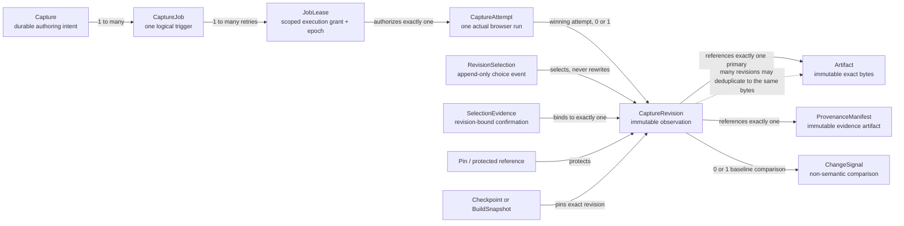
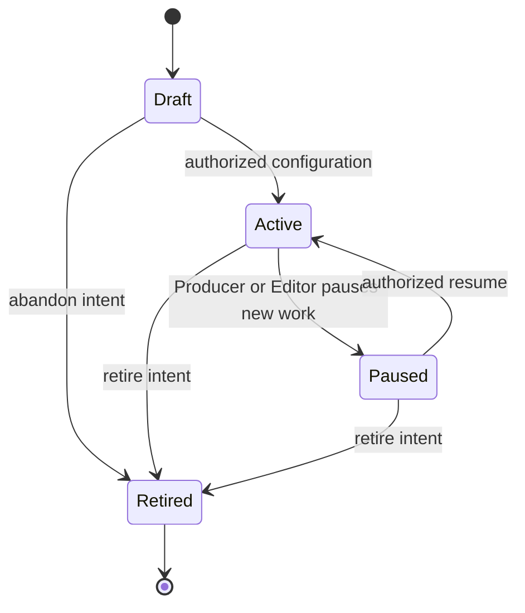

# Issue 27 — public-webpage capture lifecycle, trust, and revision contract

Status: **Proposed for Producer acceptance**  
Scope: technical contract only; no implementation or production schedule  
Authority: GitHub issue #27, product specification Revision 2.2, accepted issue
#24 commit `e72aa24`, and accepted issue #13 commit `a23459d`

## Decision in one sentence

VERA may observe an anonymous public webpage only through a project-authorized,
resource-bounded job executed by a trusted local worker through a fresh isolated
browser and public-only egress guard; every actual browser run, committed
revision, artifact, selection, and pin remains separately identifiable and
append-only, and **production periodic recapture remains deferred** while
capture-on-demand and explicit build-time capture proceed as later bounded
slices.

This is the recommended decision. It becomes authoritative only when the
Producer records the acceptance response in §13. Until then, the roadmap issue
must remain `In review`.

## 1. Authority, reconciliation, and non-goals

The product specification establishes the durable rules:

- URLs are references, never durable media; builds use authorized, checksum-
  tracked artifacts.
- public-page capture runs through the trusted local-media boundary and a
  versioned adapter;
- requested/final URL, capture time, viewport, scale, adapter, artifact hash,
  and warnings are provenance, not optional diagnostics;
- capture-on-add and manual recapture ship before scheduled monitoring;
- a recapture creates a new selectable revision and cannot change an existing
  build; and
- scheduled monitoring revives only after a build is actually burned by a
  stale capture more than once.

Producer-accepted issue #24 adds `Now`, `On build`, and `Periodic` as the
conceptual policy vocabulary, immutable revisions, protected bounded history,
and confirmed/supervised selection evidence. It explicitly says that
acceptance did not amend `ScriptDocument v1` or authorize implementation.

These inputs are compatible. `Periodic` is a reserved policy and lifecycle,
not evidence that the product-spec trigger has fired. This contract therefore
defines how periodic jobs would be authorized and retained, but decision
P27-01 in §11 keeps the production scheduler disabled.

This contract does not:

- change a shared schema, generated type, fixture, golden, or accepted test;
- choose a database, queue, browser engine, object store, cloud, OCR provider,
  compositor, or deployment topology;
- authorize browser extensions, attached-user-browser capture, cookies,
  credentials, authenticated/paywalled pages, or user-secret use;
- define UI, visual tokens, notification behavior, a material-change
  threshold, schedule frequency, numeric retention defaults, or deletion;
- implement issue #24's YouTube composite, OCR Spotlight, motion, or remapping;
  or
- enter issue #14 or #21 scope.

## 2. Entity and state model

### 2.1 Identity diagram

The diagram's distinctions are contractual:

| Entity | Meaning | Mutable behavior allowed |
| --- | --- | --- |
| `Capture` | Stable project-owned authoring intent: public URL reference, capture profile, region intent, and trigger policy. It is not an image and is not “the latest page.” | New configuration/state events may advance its current view; its ID and history never change. |
| `CaptureJob` | One logical trigger: a manual `Now` request, an explicit `On build` request, or a future scheduled slot. It owns idempotency and the terminal logical outcome. | State advances by append-only job events. A job commits at most one revision. |
| `JobLease` | Short-lived capability granting one worker one job epoch. It is not project membership or a general capture credential. | May be renewed while current, then released, expired, or revoked. It cannot be reused. |
| `CaptureAttempt` | One real browser execution under one current lease. Retries are distinct attempts, so every network observation has its own evidence. | Terminal only: committed, failed, cancelled before navigation, or abandoned after lease loss. |
| `CaptureRevision` | One immutable, time-bounded observation committed by the winning attempt. It names exact artifact and provenance evidence. | Never edited or overwritten. Later use/assessment is recorded in separate events. |
| `Artifact` | Verified bytes identified by digest, byte length, MIME type, and dimensions where applicable. | Bytes and identity never change. Corruption creates an integrity incident, not replacement under the same identity. |
| `ProvenanceManifest` | Immutable, access-controlled explanation of how one revision was observed. | Never edited; corrections are superseding audit annotations, not history rewrites. |
| `ChangeSignal` | Deterministic comparison between this revision and a named baseline. It reports exact-byte and provenance differences only. | Never selects, replaces, notifies, or claims material significance. |
| `RevisionSelection` | Append-only event choosing an exact revision for a document occurrence, Draft state, preview, or build. | A later choice creates another event; the prior event and target revision remain. |
| `SelectionEvidence` | Author-confirmed region/target evidence tied to one exact revision. It supports the later Spotlight handoff without requiring OCR here. | A remap is a new proposal/confirmation; evidence never migrates silently. |
| Pin/protected reference | A reason a revision and its artifacts must remain available. | One reason may be released without defeating any other reason. |

### 2.2 Non-negotiable cardinality and immutability invariants

1. One `Capture` may have many jobs and revisions. A revision belongs to one
   Capture only.
2. One job may have several lease epochs and actual attempts, but it has at
   most one committed `revisionId`. A unique job-output constraint enforces
   this at commit time.
3. One lease authorizes exactly one attempt. An attempt cannot move to another
   lease, job, Capture, project, or profile.
4. One successful committed attempt produces exactly one revision, one primary
   raster artifact reference, and one provenance-manifest reference in one
   atomic logical commit.
5. A failed, rejected, cancelled, abandoned, or late attempt produces no
   revision. Its sanitized diagnostics remain audit evidence.
6. A new successful observation creates a new revision even when its raster
   bytes are identical to an earlier artifact.
7. Many revisions may reference the same exact-byte artifact. That storage
   optimization never merges their times, provenance, authorization, warnings,
   selections, or retention references.
8. A revision number is monotonically allocated within one Capture at commit.
   Missing numbers are acceptable after aborted transactions; reuse is not.
9. “Latest” is a query over committed revision order, never an identity and
   never an implicit build input.
10. A build, checkpoint, or occurrence names an exact revision. Rebuilding or
    recapturing never resolves that reference to a newer revision.

### 2.3 Capture lifecycle

- `Draft` cannot enqueue a job.
- `Active` permits role-valid `Now` and `On build` jobs. It does not by itself
  authorize `Periodic`; §11 keeps that execution capability disabled.
- `Paused` and `Retired` prevent new jobs. Existing revisions, selections,
  builds, checkpoints, evidence, and pins remain readable and protected.
- Retirement is non-destructive. A new intent uses a new `captureId`; history
  is not resurrected by editing a retired record.

### 2.4 Job, lease, and attempt lifecycle

| Object | States | Required transition rules |
| --- | --- | --- |
| Job | `requested` → `rejected` or `queued` → `leased` → `running` → `committed_ready`, `committed_review_required`, `failed`, or `cancelled` | Admission rejection is terminal. Lease expiry before commit returns a retryable job to `queued` only within its versioned retry budget. A duplicate idempotency key returns this job rather than creating another. |
| Lease | `issued` → `active` → `renewed` zero or more times → `released`, `expired`, or `revoked` | Every lease carries `jobId`, worker identity, expiry, epoch, and scoped capabilities. Only the current epoch may stage or commit. Renewal cannot expand scope. |
| Attempt | `started` → `staged` → `committed`, or `started`/`staged` → `failed`, `cancelled`, or `abandoned` | Starting an actual browser process creates the attempt record first. A result after lease loss is `abandoned_late_result`; it cannot commit or select. |

Cancellation is best-effort before commit. Once a revision commits, a later
cancel request cannot erase it; the user may simply leave it unselected.

### 2.5 Revision, artifact, and use lifecycle

A verified candidate may commit as:

- `ready`: security, integrity, and required completeness checks passed;
- `review_required`: bytes and provenance are valid, but visible conditions
  such as a consent overlay, failed public subresources, an unstable page, or
  a bounded-load warning require an explicit use decision.

Hard security denial, browser failure, artifact verification failure, or
missing required provenance creates no revision. A `review_required` revision
may be used in a preview only after an Editor or Producer records an
acknowledgment. Release use requires a Producer's explicit use decision. The
decision is append-only and does not modify the revision.

Artifacts move from worker-local `staged` to digest/decoder `verified` to
project reference `committed`. An artifact is then either protected by one or
more references or unreferenced. “Retention eligible” is a derived condition,
not a destructive artifact state and not permission to delete under this
issue.

### 2.6 Selection-evidence lifecycle

```mermaid
stateDiagram-v2
    [*] --> Proposed
    Proposed --> Confirmed: Editor or Producer confirms
    Proposed --> Rejected: author rejects
    Confirmed --> Superseded: a new confirmed choice replaces current authoring use
    Confirmed --> StaleForNewRevision: recapture changes the source revision
    StaleForNewRevision --> [*]: retain; a separate proposal starts
    Rejected --> [*]
    Superseded --> [*]
```

`SelectionEvidence` may describe a capture region, a manually selected content
target, or a later adapter's proposed target. It always stores the exact
`revisionId`, author or proposing adapter, versioned method, source-relative
geometry/evidence digest, creation time, and confirmation event. Manual
selection remains valid without automation.

A recapture does not edit or invalidate the evidence for its original
revision. It makes that evidence inapplicable to the new revision. Any proposed
remap receives a new identity and requires explicit confirmation. This is the
contract boundary needed by issue #24's Spotlight decision; OCR and remapping
algorithms remain outside #27.

## 3. Authorization and trust boundaries

### 3.1 Boundary table

| Boundary / principal | May do | Must not do | Required evidence |
| --- | --- | --- | --- |
| Hosted authoring API | Authenticate the suite user; recheck project membership and role on every mutation/read; validate Capture configuration; allocate jobs/idempotency; issue narrow worker/artifact capabilities; commit metadata transactionally; authorize selections and pins. | Fetch the page by bypassing the capture boundary; trust renderer visibility; accept a source-product permission claim; expose exact sensitive URLs in ordinary logs; let a worker decide project policy. | Stable actor/service principal, project/role decision, request ID, settings hash, idempotency key, capability scope/expiry, audit event. |
| Trusted local worker | Accept an API-signed job for the matching project and local-agent installation; start the sandbox; enforce the versioned resource profile; stage artifacts/provenance; ask the API to commit while its lease is current. | Browse arbitrary URLs; inherit user browser state; access unrelated projects/files; choose schedules, selections, pins, or retention; commit after lease loss; attach to the user's browser. | Worker/agent build, installation identity, job and lease epoch, browser/profile versions, start/end times, outcome. |
| Public-only egress guard | Canonicalize and resolve admitted destinations; enforce allowed schemes/ports/methods; verify actual peer addresses; revalidate redirects and every network request; apply byte/request/time limits. | Rely on hostname syntax or one preflight DNS lookup; permit private/local/metadata peers; permit direct browser-network fallback. | Resolution answers, admitted/denied addresses, actual peers, redirect chain, blocked requests, bound counters. |
| Isolated browser sandbox | Navigate one admitted top-level URL; run public page code within the sandbox; fetch admitted public subresources through the guard; render and return a raster plus bounded diagnostics. | Read loopback/private networks, local files, clipboard, devices, credentials, cookies from another attempt, browser profiles, extensions, password stores, client certificates, or artifact storage; open downloads or external applications. | Ephemeral profile ID, browser engine/build, sandbox policy hash, viewport/profile, network manifest digest, warnings. |
| Artifact service | Verify digest, length, MIME, decoder safety, and dimensions; create project-scoped references; serve only after a fresh authorization check; maintain reference/pin graph. | Treat a content hash or URL as authorization; serve active HTML/script as the captured visual; allow cross-project deduplication to leak existence; overwrite bytes; delete protected bytes. | Artifact digest/length/type/dimensions, verification result, project reference, access/pin events. |
| Build coordinator/compiler | For an authorized preview/release action, resolve an exact ready/accepted revision, or request one explicit `On build` job; freeze revision/artifact/provenance IDs into the immutable build snapshot. | Resolve “latest”; silently fall back to an older revision after capture failure; mutate authoring selection; recapture an existing checkpoint/build. | User/build authorization, source document revision, job/revision IDs, use decision, snapshot reference. |
| Future scheduler (disabled) | If later authorized, create one job for one Producer-approved active policy and deterministic schedule slot. | Edit Capture settings, select results, acknowledge warnings, pin/unpin, notify, or retry outside policy. | Policy version, schedule slot/timezone, service principal, idempotency key, skipped/run outcome. |
| Future retention worker (no deletion authorized here) | Evaluate reference graph and record a proposed eligibility set under one Producer-approved policy version. | Read page content unnecessarily; remove anything protected; infer that duplicate bytes mean duplicate provenance; execute deletion under #27. | Policy version, graph snapshot, each protection reason, candidate list, dry-run audit event. |

The isolated browser is an untrusted-content boundary even though the local
worker is trusted. Browser compromise must terminate at the sandbox and egress
guard rather than inherit the worker's project, filesystem, or network
authority.

### 3.2 Role/action matrix

| Action | Viewer | Editor | Producer | System principal |
| --- | --- | --- | --- | --- |
| Read a Capture and revision referenced by a document/history/build the member may view | Yes | Yes | Yes | Only for a scoped job/build |
| Read artifact bytes | Yes, only through an authorized visible reference | Yes | Yes | Worker/build gets a short-lived reference-specific capability |
| Create/configure/retire Capture intent | No | Yes | Yes | No |
| Request `Now` / manual recapture | No | Yes | Yes | API enqueues only after that request is authorized |
| Request `On build` | No | Preview build only | Preview or release build | Build coordinator only for the authorized build |
| Select a ready revision for current Draft/occurrence | No | Yes | Yes | No implicit service selection |
| Acknowledge `review_required` for preview | No | Yes | Yes | No |
| Accept `review_required` for release | No | No | Yes | No |
| Confirm region/selection evidence | No | Yes | Yes | Adapter may propose, never confirm |
| Add/remove an explicit user pin | No | Yes | Yes | Automatic reference pins are managed by owning subsystem |
| Create/change/enable `Periodic` policy | No | No | **Reserved for Producer, but disabled by P27-01** | Future scheduler cannot grant itself this authority |
| Configure retention parameters or approve a dry run | No | No | Yes, in a later authorized slice | Retention service evaluates only |
| Delete a revision/artifact | No | No | No under #27 | No under #27 |

Role removal is effective on the next request and terminates write-capable
sessions as the product specification requires. A worker capability already
issued before removal may finish only if the API's commit step rechecks that
the initiating action remains valid or was an already-authorized immutable
build job. Policy is explicit per operation; browser possession of a job token
is never user authority.

### 3.3 Artifact-access invariants

1. Capture does not publish an artifact. Public source visibility and artifact
   access are separate decisions; the artifact remains project-confidential.
2. A digest is identity evidence, not a bearer credential. Every read checks a
   project-owned reference and current membership.
3. Signed/read capabilities are single-purpose, short-lived, project/reference
   scoped, and safe to revoke. They are not stored in provenance or UI URLs.
4. Exact-byte physical deduplication across projects is optional. If used, it
   must not reveal whether another project has the bytes, couple retention, or
   bypass independent encryption and authorization.
5. Browser output crosses into artifact storage through a narrow worker
   staging path. The sandbox itself receives no artifact-service credential.
6. Captured visual artifacts are decoded and served as inert raster media with
   correct type, `nosniff`, and non-executable disposition. HTML, JavaScript,
   downloaded files, and browser profiles are not the visual artifact.

## 4. Public-page-only admission contract

### 4.1 Meaning of “public page”

A page is eligible only when a fresh anonymous browser can request it without
VERA supplying credentials, session state, an attached browser, a client
certificate, a private-network route, or a secret-bearing URL. “Public” does
not mean VERA may redistribute the result publicly, that the content is free
of personal information, or that a later observation will match.

Authentication challenges, paywalls, personalization gates, CAPTCHA/bot
challenges, consent overlays, and blocked automation are not bypassed. If a
safe raster can be produced, the condition is visible and normally
`review_required`; otherwise the attempt fails and the user may supply a
screenshot as an Image under issue #24's Image/Capture distinction.

### 4.2 Admission and connection sequence

Every top-level navigation, redirect, frame, and subresource network request
passes the same policy sequence:

1. Parse with one standards-compliant URL parser; reject ambiguous/noncanonical
   host representations before policy comparison.
2. Permit top-level `http` or `https` only. The baseline permits ports 80 and
   443 only and rejects username/password userinfo and raw IP-literal hosts.
3. Normalize the host through IDNA and retain both safe display and ASCII
   forms. A fragment is excluded from the network request/provenance identity.
4. Reject known or suspected credential-bearing query keys/values and signed-
   URL shapes. A benign query remains project-sensitive: execution may use it,
   restricted provenance retains it, and ordinary logs/UI redact its values.
5. Resolve all A/AAAA answers through the controlled resolver. Reject the
   destination if any answer is not globally routable public space; do not
   “pick the public answer” from a mixed set.
6. Deny all loopback, private, link-local, carrier-grade NAT, benchmark,
   documentation, multicast, unspecified, reserved, IPv4-mapped, transition,
   and cloud-metadata destinations after canonical address normalization.
7. Bind admission to the resolved public address set and require the egress
   guard to verify the actual socket peer for each connection. DNS rebinding or
   a peer outside the admitted set terminates the request.
8. Repeat the complete sequence for each redirect and each network-bearing
   subresource. There is no direct browser fallback if the guard cannot enforce
   a request.
9. Enforce the versioned resource/security profile throughout the attempt.
10. Commit only after the raster, provenance manifest, warnings, and digests
    verify together under the current lease epoch.

### 4.3 Threat model

| Threat / failure mode | Required prevention or containment | Evidence / visible result |
| --- | --- | --- |
| Parser confusion, encoded host, alternate numeric IP, backslash, or userinfo trick | One canonical parser; reject ambiguous syntax, userinfo, and raw IP literals; classify normalized binary IP values, not strings. | Admission rejection with sanitized reason and URL hash; no network. |
| Loopback/private/local target | Reject IPv4 and IPv6 loopback, private, link-local, local-use, CGNAT, multicast, unspecified, reserved, and transition/mapped forms. | `private_target_denied`; redacted address class retained. |
| Cloud metadata service | Deny link-local/CGNAT metadata addresses and known metadata-only hostnames before connection; no custom metadata headers. | `metadata_target_denied`; no response body retained. |
| DNS rebinding or mixed public/private DNS | Reject a mixed answer set; pin admitted public answers; validate actual peer on every socket; re-resolve only through guarded policy. | DNS answers, admitted set, actual peer, and mismatch failure in restricted evidence. |
| Redirect to a forbidden target | Re-run URL/query/DNS/peer policy at every hop; enforce finite redirect count and loop detection. | Redacted redirect chain and exact denied hop in restricted evidence; no revision. |
| Public top-level page loading private subresources, frames, WebSockets, or peer connections | Route all browser traffic through the guard; apply the same address policy to frames/subresources; disable WebSockets/WebRTC in the baseline. | Blocked-resource manifest and `review_required` or hard failure by profile. |
| Non-web schemes or dangerous ports | Top-level only `http`/`https`; baseline ports 80/443; deny `file`, `ftp`, `gopher`, `data`, `blob`, `javascript`, extension, custom, and external-app navigation. Bounded page-created data/blob content may render only inside the sandbox and cannot become a network escape. | Denial reason and scheme/port category. |
| Ambient cookies or logged-in browser state | Fresh ephemeral profile per attempt; no imported cookies, cache, local/session storage, extension profile, password manager, auth header, client certificate, or previous-attempt state. Page-set state dies with the attempt. | Clean-profile and isolation-policy identifiers in provenance. |
| Proxy, environment, or worker credentials leaking into the page | Capture process receives an allowlisted environment; egress proxy capability is internal and origin-bound; no user/project secrets in headers, command line, page JavaScript, or diagnostics. | Worker policy hash and secret-redaction check. |
| Secret-bearing query URL | Reject userinfo, recognized token/signature keys, signed URLs, and high-confidence secret shapes; never copy source-product or user credentials. Redact benign query values outside restricted provenance. | Sanitized rejection or query-key list + exact-URL digest; no secret in ordinary audit. |
| Query/search privacy despite a public response | Treat all requested/final URLs as project-confidential metadata; top-level request has no app referrer; normal views show a redacted URL; artifact access remains private. | Access-controlled exact URL, redacted display URL, digest, and access log. |
| Page causes side effects | Baseline egress allows `GET` and `HEAD` only; blocks form submission, mutation methods, downloads, external protocol launches, payments, notifications, geolocation, camera/mic, clipboard, and filesystem APIs. No automated clicks or consent acceptance. | Blocked-action warnings; page may become `review_required`. |
| Browser exploit reaching the workstation | Disposable OS/process sandbox; no host filesystem mount, local network, inbound listener, remote debugging, device access, or broad worker IPC; worker kills the sandbox at attempt end. | Sandbox-policy version, process outcome, crash/violation audit. |
| Resource exhaustion or decompression bomb | Finite profile caps for URL/redirects, requests, individual/total bytes, frames, viewport/output pixels, decoded dimensions, CPU, memory, navigation/total time, and concurrent attempts; decoder verifies output before commit. | Counters and first exceeded bound; no artifact commit on integrity risk. |
| Infinite/dynamic page, animation, delayed fonts/assets | Versioned wait/stability policy and hard deadline; record load signals, blocked/failed resources, animation/font policy, and warnings. Never claim the page was “complete.” | `ready` or `review_required` with explicit load warnings. |
| Consent, login, paywall, CAPTCHA, or personalized state | Do not bypass or inject identity. Heuristics may label the visible condition but cannot certify absence. Safe raster is review-required; unusable capture fails. | Visible preview state, warning code, anonymous-profile evidence. |
| Malicious page title/header/log injection | Normalize length/encoding, escape control characters, and keep untrusted page text out of executable logs/commands. | Sanitized title/header subset plus content digests. |
| Captured HTML/script served back to users | Primary visual artifact is a verified inert raster; provenance JSON is served non-executable and authorization-gated; source HTML/browser profile/downloads are not served as the capture. | MIME/decoder verification and response-security metadata. |
| Public content contains personal/sensitive information | Capture does not make it public, send it to another product, or grant cross-project access. Project membership applies to every artifact read; Producer decides later distribution through ordinary build flows. | Project reference, access audit, no public-sharing side effect. |
| Captured page changes after validation | Every attempt is a time-bounded observation. Provenance records actual peers, redirects, timing, runtime, warnings, and bytes; no reproducibility guarantee. | Explicit `observation_not_reproduction` statement on every revision. |

### 4.4 Required resource-profile fields

The capture implementation cannot ship with an unbounded or implicit default.
One immutable, hashed profile version must provide finite values for:

- URL length, redirect count, and redirect-loop detection;
- DNS answers and connection attempts per request;
- top-level, frame, subresource, and total request counts;
- individual-response and total transferred bytes;
- frame depth and popup/new-window count (baseline popup count is zero);
- navigation, stability-wait, script CPU, and total attempt wall time;
- browser memory, process count, and concurrent jobs per worker;
- viewport width/height, device scale, decoded pixel count, and raster byte size;
- console/network diagnostic count and per-field length; and
- retry count, lease duration, and heartbeat interval.

The later implementation slice selects tested numeric values and obtains
Producer acceptance. Reducing a security bound is a profile revision. Raising
one requires threat/load evidence and cannot mutate provenance for prior
captures.

## 5. Capture profile and deterministic conditions

Every job freezes a versioned settings snapshot before it enters the queue.
At minimum it includes:

- canonical requested URL identity and restricted exact URL;
- capture region intent or full-viewport selection;
- viewport, device scale, output encoding, color profile, and background;
- browser/adapter and security/resource-profile versions;
- user agent/client-hint policy, locale, timezone, reduced-motion/animation
  policy, font policy, and media/autoplay policy;
- JavaScript mode, blocked capability set, allowed methods/schemes/ports;
- load/stability condition and hard deadline;
- warning-to-`review_required` policy; and
- settings hash used by idempotency and provenance.

The settings snapshot is not a claim of deterministic rendering. Remote
content, server geolocation, A/B tests, time, client hints, fonts, JavaScript,
ads, consent state, and public resources may change. A revision records what
this attempt actually observed under those settings.

## 6. Provenance and audit contract

### 6.1 Required immutable provenance

| Group | Required fields/evidence |
| --- | --- |
| Identity | `projectId`, `captureId`, `jobId`, winning `leaseId`/epoch, `attemptId`, `revisionId`/number, primary `artifactId`, provenance-manifest artifact ID, optional comparison baseline and change-signal ID. |
| Authorization | Trigger (`now`, `on_build`, reserved `periodic`), stable initiating actor or service principal, role/policy decision, request ID, authorization time, originating document/build/checkpoint identity where applicable. |
| Request | Restricted exact requested URL; redacted display URL; canonical URL digest; benign query-key list; settings/profile IDs and hashes; requested region; idempotency scope/key digest; request/enqueue times. |
| Network | Resolver/time, all top-level A/AAAA answers, admitted public set, actual peers, TLS validation outcome, redacted redirect chain and restricted exact chain, response statuses, final URL/title, top-level response metadata subset, subresource/frame manifest digest, denied/failed resources, byte/request counters. |
| Runtime | Local-agent/worker build and installation identity, operating/sandbox image identity, browser engine/build, adapter build, isolation/security policy hash, clean-profile ID, locale/timezone/user-agent policy, viewport/scale/color/output settings. |
| Timing/stability | Wall-clock and monotonic start/end, navigation/load milestones actually observed, wait/stability rule and outcome, deadline/bounds reached, retry/lease history, capture instant. |
| Output | Captured region in source and normalized coordinates, output dimensions/encoding, artifact SHA-256 (or later approved algorithm), byte length, MIME, decoder verification, color/alpha metadata, staging/commit result. |
| Honesty/warnings | Page/load/auth/consent/dynamic/blocked-resource warnings, partial-state reason, review classification, sanitization/redaction version, and explicit statement that this is an observation rather than a guaranteed reproduction. |

The main navigation chain and sensitive query values live only in the
restricted provenance envelope. Normal audit output uses redacted URLs and
digests. Rejection of a secret-bearing URL records enough to explain the denial
without retaining the secret itself.

“Complete provenance” means every condition VERA controlled or observed that
is needed to explain the raster and its limitations is present or explicitly
marked unavailable. It does not require storing source HTML, third-party
credentials, arbitrary response bodies, or a replayable user session.

### 6.2 Append-only audit events

Audit events are required for:

- Capture create/configure/activate/pause/resume/retire;
- job request, admission/rejection, enqueue, cancel, retry, and terminal result;
- lease issue/renew/expire/revoke/release and late-commit denial;
- attempt start/stage/fail/abandon/commit;
- artifact stage/verify/reference/integrity failure;
- revision commit and review/use decision;
- selection, selection-evidence proposal/confirmation/rejection/stale/remap;
- explicit and automatic pin add/release;
- artifact/provenance read grants and denied reads; and
- retention policy change, graph evaluation, and dry-run eligibility.

Each event carries stable actor/service identity, project, object IDs, event
type, server time, request/correlation ID, before/after state identifiers where
applicable, policy/profile version, and sanitized result. Page-controlled text
and secrets never become unescaped event fields. The event log is append-only;
an explanatory correction points to the original event.

## 7. Idempotency, concurrency, and failure behavior

### 7.1 Idempotency scope

The API requires an opaque caller-generated idempotency key and derives its
uniqueness scope from:

- project and `captureId`;
- trigger kind;
- manual command identity, immutable `buildId`, or future schedule-policy
  version plus deterministic slot;
- frozen settings hash; and
- authorized initiating principal.

A repeated request in the same scope returns the existing job and outcome. It
does not enqueue another capture, create another revision, or repeat a
selection. A deliberate new manual recapture uses a new command/key.

`On build` is keyed to the immutable build request. Retrying that build cannot
observe a different page under the same job identity after a revision commits.
If no result committed and a retry requires a new actual browser run, that run
is a new `CaptureAttempt` under the same job and is visible in provenance.

The reserved future periodic key is
`captureId + schedulePolicyVersion + canonicalScheduleSlot`. Clock drift,
worker restarts, and duplicate scheduler delivery therefore converge on one
job. This definition does not enable scheduling.

### 7.2 Lease and commit rules

1. Job execution is at-least-once; revision creation and selection effects are
   exactly-once through transactional uniqueness and compare-and-swap.
2. A worker stages output under `jobId`, `attemptId`, and lease epoch. Staged
   bytes are not a revision and are not selectable.
3. Commit rechecks current lease epoch, job terminal state, artifact/provenance
   verification, and unique job output.
4. Lease loss before commit makes the attempt unable to commit. A late result
   is audit evidence only and is removed from staging under a separate safe
   cleanup policy.
5. The winning commit atomically creates the revision, artifact references,
   provenance reference, default change signal, terminal job event, and any
   explicitly authorized selection event.
6. If atomic commit is uncertain, the client queries by job/idempotency key.
   It never starts a logically new job merely because the response was lost.

### 7.3 Trigger-specific selection

- `Now`: a normal recapture creates an unselected candidate. A distinct
  `capture and use when ready` command may include an explicit conditional
  selection, but commit applies it only if the target document/occurrence still
  matches the authorized expected revision. Otherwise the capture succeeds and
  remains unselected for review.
- `On build`: the successful capture is pinned only into that build snapshot.
  It does not move the authoring Draft's current selection. Capture failure
  blocks the build or offers an explicit user choice to use a named older
  revision; there is no silent fallback.
- Reserved `Periodic`: a future scheduled result would be an unselected
  candidate. It could never rewrite Draft, checkpoint, or build selection.

This preserves issue #24's explicit `Refresh page now` semantics: the primary
authoring command may ask to capture and conditionally select, but success is
still a new revision plus a new selection event. Neither identity is replaced.

### 7.4 Failure matrix

| Failure class | Revision result | Required user/system behavior |
| --- | --- | --- |
| Invalid URL, secret-bearing URL, forbidden scheme/port, denied top-level/redirect DNS/address/peer, or an egress guard unable to verify the actual peer | None | Terminal sanitized failure; no fallback network path. |
| Authorization or membership failure | None | Nonrevealing denial; revoke job capability if not already terminal. |
| Browser crash, sandbox violation, lease loss, deadline, or retry exhaustion | None | Retain attempt/job diagnostics; retry only within job policy or create an explicit new job. |
| Raster/provenance digest, decoder, dimension, or atomic-commit verification failure | None | Quarantine staging, record integrity failure, never publish/select partial output. |
| Safely blocked forbidden subresource/frame, consent/login/paywall/CAPTCHA overlay, failed public assets, dynamic/unstable page, or bounded-load warning with otherwise safe verified raster | `review_required` | Show exact warning and preview; explicit preview/release use decision required. |
| Fully verified safe observation | `ready` | Make selectable; do not select unless trigger-specific rules authorize it. |
| Duplicate command or lost API response | Existing job/revision | Return the prior outcome by idempotency key; create nothing new. |
| Late worker commit after another attempt won | Existing winning revision only | Deny late commit; record abandoned/duplicate evidence; no second selection. |

Failures never erase the URL/card or prior selections. Retrying never mutates a
prior attempt, revision, artifact, checkpoint, or build.

## 8. Exact-byte deduplication and change signals

### 8.1 Deduplication

VERA deduplicates only exact verified bytes within an authorization-safe
storage domain. The primary key is the approved digest plus byte length and
verified type; a digest collision or metadata mismatch is an integrity failure,
not a match.

Each successful job still creates a new revision because capture time,
redirects, page state, warnings, runtime, and authorization are distinct
observations. Two revisions that reference one artifact remain independently
selectable and auditable.

Visual similarity, OCR equality, DOM equality, perceptual hashes, titles,
response validators, and normalized screenshots are not deduplication. They
may become future advisory signals but cannot merge bytes or revisions.

### 8.2 Change signal

On commit, VERA compares the new revision to the immediately preceding
committed revision for the same Capture unless an explicit comparison baseline
is named. The immutable signal reports:

- `initial_observation`, `same_exact_bytes`, `different_exact_bytes`, or
  `not_comparable` when profiles/regions are incompatible;
- baseline and current revision/artifact IDs;
- whether final URL, redirect chain, capture profile, viewport/region,
  warnings, or load evidence changed; and
- comparison algorithm/version and time.

The signal does **not** mean “material change,” quality, truth, relevance, or
approval. It never automatically selects a revision, replaces an artifact,
starts a build, sends a notification, prunes history, or repairs selection
evidence. Any later material-change threshold requires its own Producer-
approved contract.

## 9. Selection, pinning, and non-destructive retention

### 9.1 Selection rules

Selection is an append-only event containing the exact revision, target
document/occurrence/build context, stable actor, authorization result, previous
selection event, reason/trigger, and time. The current selection is derived
from the document history; it is not stored as a mutable “latest revision”
alias.

A checkpoint materializes the selection then current. A build snapshots that
exact revision and artifact. Restoring a checkpoint creates a new authoring
transaction that points to the old revision; it does not rewind capture
history. A recapture never changes any of these references.

### 9.2 Protection reasons

Protection is reference-counted by reason, not one mutable boolean. A revision
and all artifacts reachable from it are protected while any of these exists:

1. active Draft/occurrence selection;
2. any retained document revision or named checkpoint reference;
3. any preview or release build snapshot;
4. explicit Editor/Producer pin;
5. confirmed, proposed, or stale selection evidence whose audit/repair still
   needs the original revision;
6. active review, integrity investigation, compliance/audit hold, or unresolved
   job/commit incident; or
7. another project-scoped logical artifact reference when physical bytes are
   safely deduplicated.

Removing one explicit pin removes only that reason. It cannot defeat a build,
checkpoint, document, evidence, hold, or other-project reference. A pin event
cannot retarget from one revision to another; changing the target is add-new,
then release-old after re-evaluation.

### 9.3 Retention eligibility

Issue #24 requires bounded history for future periodic capture but leaves
count/age as later input. #27 defines the safe shape without choosing numbers
or authorizing deletion:

- a Producer-approved policy version may contain both count and age/grace
  criteria for unreferenced periodic revisions;
- absent an approved policy, VERA retains all committed revisions;
- only a terminal revision with zero protection reasons can be proposed as
  eligible;
- eligibility uses capture/revision order, never artifact equality or
  “material change”;
- the service must recompute the reference graph immediately before any later
  destructive step and fail closed on uncertainty;
- changing policy creates a dry-run diff and audit event; it does not mutate
  old policy evidence or immediately remove anything;
- a revision ID is never recycled, an older slot is never overwritten, and a
  tombstone may never masquerade as available bytes; and
- physical artifact bytes remain while any revision or project reference
  needs them.

Under this issue the lifecycle stops at `eligible_in_dry_run`. Actual pruning,
recovery window, backup interaction, tombstone behavior, and deletion require
a separate Producer-approved destructive-operation contract and audited
product flow.

## 10. Honest reproducibility statement

Every revision must present this product-level meaning:

> This revision is an immutable record of bytes VERA observed from an
> anonymous public-page attempt at the recorded time under the recorded
> profile. The artifact and provenance are reproducible as stored. The live
> page is not guaranteed to render or respond identically again.

VERA can prove the stored artifact digest, provenance manifest digest, settings
profile, and build references. It cannot prove that a mutable remote page,
third-party resource, network, browser ecosystem, geolocation, ad system,
clock, font, or script will recreate the same pixels later. A new fetch is a
new attempt and, if committed, a new revision.

## 11. Periodic monitoring decision

### P27-01 — keep production periodic recapture deferred

**Recommended decision:** keep production `Periodic` execution deferred.

Rationale:

1. The product specification's revive trigger is precise: a build must be
   actually burned by a stale capture more than once. No accepted evidence for
   that trigger is part of #27.
2. Issue #24 accepted the policy vocabulary and immutable/protected history,
   not a frequency, timezone, retry/backoff, cost, notification, retention
   number, or production scheduler.
3. `Now` and `On build` cover deliberate freshness while preserving an
   accountable user/build trigger.
4. Deferral avoids deploying an unattended browser and retention/deletion
   mechanism before its operational policies and real need are accepted.

Consequences:

- later capture-engine work implements `Now`, manual recapture, and explicit
  `On build` only;
- the logical model reserves `Periodic`, deterministic schedule-slot
  idempotency, Producer-only authorization, unselected results, and protected
  retention so revival does not require changing revision identity;
- no scheduler, frequency control, unattended capture, material-change
  evaluation, notification, or periodic pruning ships under #27; and
- the product-spec trigger remains visible in the Deferred Register.

Revival requires a separate roadmap issue after the Producer records the
trigger evidence. That issue must decide schedule frequency/timezone, pause and
missed-run behavior, retry/backoff, resource/cost ceilings, notifications,
numeric retention/recovery defaults, privacy review, and acceptance using a
safe public fixture. It must depend on an accepted capture engine; hierarchy
alone is not sufficient.

The Producer records this decision explicitly by using the acceptance phrase
in §13. Choosing to revive periodic production now is not a wording edit: it is
a failure of this proposed decision and requires the missing scheduling policy
to be bounded and reviewed before #27 can be accepted.

## 12. Bounded implementation handoff

This investigation authorizes no implementation. After Producer acceptance,
the roadmap steward may create only bounded follow-ups that preserve this
contract.

### 12.1 Capture-engine contract/implementation slice

The capture slice may cover:

1. an explicit shared-contract-change proposal for the minimum entity fields,
   migrations, generated types, fixture/golden effects, and acceptance change;
2. hosted API admission/authorization/idempotency and transactional job output;
3. trusted local-worker capability verification, leases, attempts, and
   disposable browser isolation;
4. public-only egress enforcement for top-level, redirect, frame, and
   subresource traffic;
5. versioned resource/profile limits and safe raster verification;
6. immutable artifact/provenance storage, exact-byte deduplication, change
   signals, append-only selection, and protection graph;
7. `Now`, manual recapture, and explicit `On build` behavior only; and
8. automated adversarial fixtures for URL parsing, every denied network class,
   DNS rebind/redirect/subresource escapes, duplicate delivery, lease loss,
   late commit, warning review, same-byte new revision, selection concurrency,
   and pin protection.

It excludes UI/high-fidelity design, periodic scheduling, notifications,
material-change semantics, authenticated capture, browser attachment,
retention deletion, YouTube composite, OCR, Spotlight matte, motion, and
Resolve materialization. Producer acceptance must include a safe synthetic
public fixture and proof that no test reaches the real private/local network.

### 12.2 Spotlight contract/implementation slice

The Spotlight slice may consume only an already committed exact
`CaptureRevision` plus revision-bound `SelectionEvidence`. Its baseline must:

- support a manual confirmed region without OCR;
- store any automated/DOM/OCR suggestion as a versioned proposal, never as
  author confirmation;
- create a new evidence record for a recapture/remap and keep the old revision
  and evidence intact;
- block use on stale/ambiguous evidence until the author keeps the prior
  capture, accepts the new proposal, or redraws;
- generate its matte/result as a separately hashed immutable artifact and pin
  all source/evidence/derivation identities into the build; and
- preserve issue #24's composition order without allowing a matte or motion
  update to mutate the capture revision.

OCR provider choice, word-box contract, accessibility interaction, matte
format, Resolve representation, and high-fidelity UI each need their own
accepted scope. The Spotlight slice does not gain network authority and cannot
request or schedule recapture implicitly.

### 12.3 Independent work remains independent

- Issue #14 owns browser-authoring visual design and may later present these
  states; it does not decide security, identity, or retention semantics.
- Issue #21 owns visual tokens; no color or style choice is made here.
- The YouTube page composite binds separate clip and page-capture revisions in
  a later compound-media contract. It cannot weaken public-only capture or
  merge clip/page identity.
- Periodic scheduling remains a separate future decision under §11.

## 13. Acceptance mapping and Producer checklist

### 13.1 Issue acceptance mapping

| Issue #27 acceptance criterion | Contract evidence |
| --- | --- |
| Entity/state diagram distinguishes capture identity, immutable revision, artifact bytes, and each attempt | §2.1 identity diagram, §2.2 cardinalities, §§2.3–2.6 lifecycles |
| Authorization/trust table covers hosted API, local worker, isolated browser, artifacts, capture/schedule/retention permissions | §§3.1–3.3 |
| Threat model covers URL validation, redirects, DNS rebinding, local/private/metadata targets, credentials/cookies, query secrets, bounds, and privacy | §§4.1–4.4 |
| Complete provenance, idempotency, dedup/change, audit, and pinned retention without false reproducibility | §§5–10 |
| Explicit periodic decision and bounded capture/Spotlight handoff | §§11–12 |

### 13.2 Producer acceptance steps

Automated repository evidence is reported on issue #27 with the review commit.
The following checks are Producer judgment and must be run in order:

1. Open this document at §2.1 and trace one `CaptureJob` through lease,
   attempt, revision, artifact, selection, and build.
   **Expected:** a duplicate/retry may create attempt evidence but at most one
   revision per job; a later revision can never overwrite the earlier
   revision, bytes, selection event, checkpoint, or build.
2. Review §§3.1–3.2.
   **Expected:** the hosted API is policy authority, the local worker has one
   narrow job capability, the browser is untrusted and isolated, artifact
   hashes grant no access, Editors may capture/select, and only a Producer may
   later enable schedule/retention policy.
3. Review §§4.1–4.4, especially DNS/actual-peer enforcement, redirect and
   subresource revalidation, private/metadata denial, query-secret rejection,
   and the clean ephemeral browser.
   **Expected:** no ambient browser cookie, attached browser, local path,
   private address, metadata target, secret-bearing URL, side-effecting method,
   or unbounded resource is available to page content.
4. Review §§6–8.
   **Expected:** one revision honestly names actor/trigger, exact restricted and
   redacted URL evidence, DNS/redirect/runtime/timing/profile/warnings, artifact
   bytes, and limitations; same bytes may deduplicate while the new observation
   remains a distinct revision; no change signal claims materiality.
5. Review §§9–10.
   **Expected:** active Draft, document/checkpoint, build, explicit pin,
   selection evidence, hold, and shared-byte references independently protect
   the exact revision and bytes; this issue authorizes no deletion; the stored
   artifact is reproducible but the live page is not promised to be.
6. Review P27-01 in §11.
   **Expected:** confirm that production periodic recapture remains deferred
   until the product-spec stale-capture trigger is evidenced; `Now` and
   `On build` are the bounded near-term triggers, and reserved periodic hooks
   do not enable a scheduler.
7. Review §12.
   **Expected:** the capture handoff owns safe acquisition/revision mechanics,
   the Spotlight handoff consumes immutable revision-bound evidence without
   silently remapping, and neither handoff enters #14/#21 or implements OCR,
   scheduling, notification, deletion, or authenticated capture.
8. Record exactly one response on issue #27:
   - acceptance: `Accept issue #27 webpage-capture lifecycle, trust, provenance, retention contract, and keep production periodic recapture deferred.`
   - failure: `Issue #27 acceptance failed at checklist step <number>: <first unsafe or missing boundary>.`

Leave issue #27 `In review` until that response is explicit. Agent self-report,
passing checks, or silence is not acceptance and must never move the issue to
`Done`.
