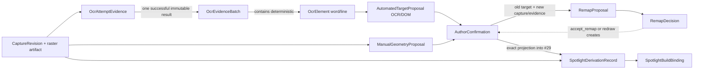

# Issue 40 — Spotlight OCR evidence and supervised remap contract

Status: **Proposed for Producer acceptance**

Scope: contract-change plan only; no shared-schema, provider, capture,
persistence, UI, compiler, matte, browser, Resolve, or deployment mutation

Authority: GitHub issue #40; product specification Revision 2.2;
Producer-accepted #24 commit `e72aa24`, #27 commit `9143518`, #29 commit
`281a5e2`, and #38 commit `f35f85f`

## Decision in one sentence

Add one closed, versioned Spotlight evidence root in issue #41 so an authorized
OCR adapter can turn one immutable capture raster into deterministic, restricted
word/line evidence and automation can create only proposals; a separately
authorized human confirmation is the sole gate into #29, and every recapture
produces a deterministic but non-authoritative remap assessment whose missing,
ambiguous, contradictory, incompatible, or manual-only result is `stale` and
whose unique result still cannot move the target until the author explicitly
keeps the old capture, accepts the remap, or redraws it.

This decision is not authoritative until the Producer records the exact
acceptance response in §14. This issue implements none of it and changes no
shared contract.

## 1. Binding boundary and reconciliation

### 1.1 Accepted behavior carried forward

The proposed contract preserves these already-accepted distinctions:

- A `CaptureRevision` is an immutable observation, not “the current page.” A
  later revision cannot rewrite its raster, provenance, selection evidence,
  protection, matte, or build use.
- A digest proves identity/integrity but never grants authorization.
- OCR, DOM, or remap automation may propose a target but cannot confirm one.
- A manual rectangle remains a first-class fallback with no OCR dependency.
- A recapture creates a new evidence/remap chain. Evidence valid for the old
  revision remains valid there but is inapplicable to the new revision.
- #29 accepts only exact confirmed geometry for the exact capture hash. Its
  integer half-open rectangles, order-independent union, parameter bounds,
  inverse `alpha8` semantics, and no-output-on-failure behavior remain frozen.
- The matte and its derivation receipt are immutable derived artifacts. A build
  pins exact source and derivation identities; it never resolves “latest.”

### 1.2 Exact boundary of this proposal

This proposal defines domain identities, hashes, deterministic transformations,
authorization gates, failure states, a future additive schema/persistence
change, and fictional verification. It does not select an OCR vendor or model,
prove provider quality, make a provider request, inspect a page, collect DOM
data, implement #29, or decide how these states look or behave in the browser.

Issue #41 may implement this backend only after #40 is accepted and #39 supplies
the approved capture identities. Issue #14 owns browser authoring and
accessibility presentation. Later compiler/Resolve work owns manifest,
composition, and delivery representation. None may weaken this identity or
confirmation boundary.

### 1.3 Identity graph



Every box is a separate identity. An arrow means “references,” never “mutates
into.” In particular, `AutomatedTargetProposal` is not an incomplete
`AuthorConfirmation`, and `RemapProposal` is not permission to derive.

## 2. Immutable records and authority

The future `SpotlightEvidenceV1` root is a closed discriminated union of the
stored record types below; `OcrElement` is a closed nested identity inside an
`OcrEvidenceBatch`, not a separately mutable record. All IDs are project-scoped
opaque UUIDs except the explicit deterministic OCR element IDs and content
digests. Every stored record has `schemaVersion`, `recordType`, `projectId`, its
own ID, `createdAt`, and a canonical payload digest. Stored records are
insert-only; correction or later choice creates another record with a reference
to the prior record.

| Record | Meaning and required identity | Who may create it |
| --- | --- | --- |
| `OcrAttemptEvidence` | One attempted adapter invocation for one capture revision/raster, authorization, execution profile, request digest, terminal outcome, bounded cost evidence, and optional successful batch ID. A failure has no batch. | Authorized service through the OCR adapter boundary. |
| `OcrEvidenceBatch` | One successful immutable canonicalization of one frozen provider response for one exact capture revision/raster and one exact provider/adapter/model/profile stack. | Authorized service after validation. |
| `OcrElement` | A deterministic `word` or `line` ID, reading order, text/context, source-pixel/normalized box, confidence evidence, and parent/child relationships inside one batch. | Canonical adapter only, as part of the batch. |
| `AutomatedTargetProposal` | A non-authoritative selection of OCR element IDs or an optional DOM adapter's proposed OCR element IDs, plus method/version/evidence digest. | Service adapter. Never a user confirmation. |
| `ManualGeometryProposal` | One author-drawn integer half-open rectangle for one exact capture revision/raster. It has no invented OCR text or confidence. | Editor or Producer. |
| `AuthorConfirmation` | An Editor/Producer decision confirming exactly one automated or manual proposal for one exact capture revision/raster. It pins actor and current authorization evidence. | Editor or Producer only; never a service/provider. |
| `RemapProposal` | A deterministic assessment from one old confirmation/capture to one named new capture revision and one named new evidence batch, including all candidates and a unique or stale outcome. | Versioned remap service. |
| `RemapDecision` | The author's explicit `keep_old`, `accept_remap`, or `redraw` choice with optimistic expected binding and any newly created confirmation reference. | Editor or Producer only. |
| `SpotlightDerivationRecord` | The exact authorized projection into #29, its immutable #29 receipt bytes/hash, matte bytes/artifact/hash, and full input chain. | Derivation service only after confirmation validation. |
| `SpotlightBuildBinding` | An immutable companion record tying one exact build reference and occurrence to one capture, confirmation/decision, derivation, receipt, and matte artifact. | Build coordinator after current project/build authorization. |

An `AuthorConfirmation` does not carry mutable states such as `stale` or
`superseded`. Staleness is always relative to a requested new capture and is
recorded on a new `RemapProposal`. A later choice is a new `RemapDecision` and,
when applicable, a new confirmation. Earlier records remain readable.

### 2.1 Authorization is separate from confirmation

OCR execution authorization, author confirmation, and build authorization are
three different decisions:

1. `OcrAttemptEvidence.authorization` proves that the service was allowed to
   process the named project raster under the named local/remote profile. It
   says nothing about which text the author wants.
2. `AuthorConfirmation.authorization` proves a current Editor or Producer
   deliberately confirmed the named proposal. Provider/service identities are
   structurally forbidden here.
3. `SpotlightBuildBinding.authorization` proves the build coordinator was
   allowed to bind the already-confirmed result to the named preview/release
   build. It cannot manufacture or update confirmation.

Every mutation rechecks project membership through #38's
`ProjectAuthorizationPort`. References to a capture, raster, proposal, build,
or digest never substitute for that check. The API uses an idempotency key and
expected current binding sequence for confirmations/decisions; a retry returns
the same record, while a concurrent mismatch fails without changing either
choice.

## 3. OCR provider and adapter seam

### 3.1 Input and output

The adapter input is exactly:

- the project/capture/revision IDs and the verified raster artifact ID/digest;
- verified raster width, height, MIME, encoding, color, and alpha metadata;
- an authorized whole-raster or integer half-open crop descriptor;
- one immutable `OcrExecutionProfileRef` and request ID; and
- optional declared language hints from the authoring project.

The provider-facing request contains only the authorized raster bytes/crop,
declared language hints, and a provider operation nonce. It contains no source
URL, final URL, redirect chain, cookies, credentials, browser profile,
provenance manifest, project/user name, build content, local path, object
locator, author confirmation, or unrelated capture data.

The adapter output is either terminal failure evidence or one batch containing
validated canonical word/line elements. It never returns an
`AuthorConfirmation`, `RemapDecision`, matte, or build binding.

### 3.2 Pinned execution identity

`OcrExecutionProfileRef` requires all of:

- `providerId`, execution location `local | remote`, provider API version, and
  adapter name/version;
- exact model name and model version, plus a provider artifact/release digest
  when the provider exposes one or an explicit `unavailable` reason when it
  does not;
- profile ID/version/digest, language policy, preprocessing policy, and
  canonicalization/geometry versions;
- maximum raster/crop pixels and bytes, timeout/retry limits, and output bounds;
- remote-only processing region, data-retention/training-use policy ID/version,
  deletion commitment, and project opt-in decision reference; and
- cost-policy ID/version, currency, estimate units, hard per-attempt cap, and
  whether the provider reports settled units.

A retry under the same provider operation/idempotency key may recover the same
attempt. Changing provider, adapter, model, profile, privacy terms, input crop,
or canonicalization creates a new attempt and batch identity. There is no
silent provider fallback.

### 3.3 Privacy, retention, and cost boundary

- Local OCR sends no raster outside the local-agent boundary, but its model
  license, model digest, machine/runtime version, and resource usage still enter
  evidence.
- Remote OCR is disabled unless the project has a current opt-in for the exact
  provider/privacy profile and the estimated maximum cost is within the exact
  approved cap. Expiry or terms/version change fails before upload.
- Raw provider request/response bytes and canonical OCR text are restricted
  project evidence artifacts. Ordinary logs contain only IDs, digests, element
  counts, bounded timing, terminal code, and cost units—never raster bytes,
  text, URLs, credentials, or object locators.
- Provider response bytes are retained only through a restricted artifact
  reference protected for as long as any batch, proposal, confirmation,
  derivation, matte, or build depends on them. #40 authorizes no deletion.
- Cost evidence records estimated cap, settled provider units when available,
  currency and cost-model version. Missing settled cost is explicit
  `unavailable`; it never changes technical evidence validity after a completed
  authorized request.

Provider quality and pricing are operational evidence for later provider
selection, not confidence in an author's intent.

## 4. Deterministic OCR evidence and geometry

### 4.1 Canonical payload

The contract defines `vera.spotlight.canonical-json.v1`: UTF-8, Unicode NFC
strings, lexicographically sorted object keys, array order preserved, integers
only, no insignificant numeric representations, and exactly one trailing LF.
Digests are lowercase `sha256:<64 hex>` over these bytes or over the exact raw
provider/raster bytes named by the field.

An `OcrEvidenceBatch` pins:

- capture revision ID, raster artifact ID/digest, and exact raster dimensions;
- attempt ID and authorization decision;
- complete execution profile reference/digest;
- exact provider request bytes digest and raw response bytes/artifact digest;
- canonicalization and geometry versions;
- reading-order policy/version;
- ordered word and line element records without derived element IDs;
- `evidenceSeedDigest` over all fields above; and
- final `evidenceDigest` over the completed batch including derived IDs.

The raw provider response is never reparsed under a new adapter/model/profile
while retaining the old batch ID. Reprocessing creates a new batch.

### 4.2 Word and line IDs

Each provider result item has a zero-based `rawOrdinal` representing its exact
position in the frozen provider response after the adapter's documented
provider-specific traversal. Duplicate text and identical boxes remain
distinguishable by this ordinal.

For each element:

```text
elementId = sha256(canonicalJson({
  identityVersion: "vera.spotlight.ocr-element-id.v1",
  evidenceSeedDigest,
  granularity: "word" | "line",
  rawOrdinal,
  canonicalText,
  providerRectMicros,
  sourcePixelRect,
  readingOrder
}))
```

The full digest is the ID; no truncation is allowed. IDs are deterministic for
the same frozen provider response and profile. A model/profile/adapter or raw
response change changes `evidenceSeedDigest` and therefore produces new IDs
without relabeling or mutating old evidence.

### 4.3 Text, context, order, and confidence

Every word stores NFC `text`, zero-based global and within-line reading-order
indexes, its parent line ID, and up to two preceding and two following word
texts/IDs with explicit start/end boundary markers. Every line stores exact
NFC line text, its ordered word IDs, global line index, and one preceding and
following line text/ID with boundary markers. The adapter may preserve a raw
text digest, but canonical text is never case-folded, stemmed, translated, or
semantically rewritten.

Confidence is evidence only:

- `provider_reported` stores a deterministically converted integer in
  millionths `0..1_000_000` and the provider scale/version; or
- `unavailable` stores the provider/adapter reason.

No confidence threshold confirms, rejects, hides, or remaps a target. Later
quality policy may rank proposals but must create a new versioned policy and
cannot alter this batch.

### 4.4 Exact coordinate conversion

Provider coordinates are first converted by the named adapter into integer
`providerRectMicros` edges measured in millionths of a source pixel:
`left`, `top`, `right`, `bottom`. The adapter rejects non-finite, negative,
inverted, overflowed, or beyond-raster edges; it does not clamp provider
evidence into validity.

The canonical source-pixel rectangle uses outward rounding once:

```text
x      = floor(leftMicros / 1_000_000)
y      = floor(topMicros / 1_000_000)
right  = ceil(rightMicros / 1_000_000)
bottom = ceil(bottomMicros / 1_000_000)
width  = right - x
height = bottom - y
```

The result must be a positive, wholly in-bounds, integer half-open rectangle.
It is the only geometry later projected into #29.

Normalized geometry is derived from those integer pixel edges, never used to
reconstruct them, and stored as integer parts per million:

```text
leftPpm   = floor(x * 1_000_000 / rasterWidth)
topPpm    = floor(y * 1_000_000 / rasterHeight)
rightPpm  = ceil((x + width) * 1_000_000 / rasterWidth)
bottomPpm = ceil((y + height) * 1_000_000 / rasterHeight)
```

All values are `0..1_000_000`. The batch records both geometries and a
`geometryDigest`. Any provider geometry that cannot satisfy these rules rejects
the entire batch and creates terminal invalid-response evidence; partial word
lists cannot become selectable evidence.

## 5. Proposals, manual fallback, and author confirmation

### 5.1 Automated proposal

An OCR proposal pins one batch, one granularity (`word_span | line_span`), a
nonempty ordered set of element IDs, exact selected/context text, source-pixel
union digest, method/version, and proposing service identity. Selected elements
must exist in that batch and be contiguous in its recorded reading order for a
v1 remappable proposal. A noncontiguous automated selection may be preserved as
an explicitly non-remappable proposal but cannot claim a v1 remap signature.

An optional DOM proposal is also automation. It pins an immutable DOM evidence
artifact digest, DOM adapter/version, capture revision/raster, and the exact OCR
element IDs onto which it projects. #40 defines no DOM capture, selector, or
geometry authority. A DOM proposal cannot bypass OCR geometry or confirmation.

### 5.2 Manual geometry

A manual proposal pins one exact capture revision/raster and one positive,
wholly in-bounds integer half-open rectangle. It carries no OCR element IDs,
text, context, provider confidence, or fictional semantic label. It is valid
when OCR is unavailable, rejected, too costly, or unwanted.

Manual geometry does not automatically remap because it has no trustworthy
semantic signature. A request to use it with a new capture produces
`stale_manual_redraw_required`; the author may keep the old capture or draw and
confirm a new rectangle.

### 5.3 Confirmation

`AuthorConfirmation` requires:

- confirmation ID/version and exact proposal ID/digest;
- capture revision, raster artifact ID/digest, and dimensions matching the
  proposal;
- source `ocr_proposal | dom_proposal | manual_geometry`;
- resolved geometry kind and exact ordered OCR element IDs/boxes or manual box;
- resolved geometry digest and exact quoted/context text for automated sources;
- actor, current Editor/Producer authorization decision, request/idempotency
  identity, expected prior binding sequence, and server time; and
- optional remap proposal/decision IDs when this confirmation accepts a remap
  or completes a redraw.

The API re-resolves and hashes the proposal before insert. A mismatch, stale
expected sequence, missing project authorization, wrong capture, or service
principal fails without a confirmation. “Proposed,” confidence above a
threshold, a provider success, a DOM match, or a unique remap is structurally
insufficient.

## 6. Deterministic supervised remap

### 6.1 Inputs and compatibility gate

`vera.spotlight.remap.exact-context.v1` consumes only:

- one old `AuthorConfirmation` and its immutable old proposal/evidence;
- one different new capture revision and raster;
- one successful new OCR batch; and
- zero or more validated optional DOM proposals for the new batch.

Old and new OCR evidence is compatible only when provider ID, adapter version,
model name/version/digest, profile ID/version/digest, text canonicalization,
geometry conversion, and reading-order policy match exactly. Any difference is
`stale_incompatible_profile`; it never attempts cross-profile matching. A
manual old confirmation is `stale_manual_redraw_required`.

### 6.2 Exact v1 matching algorithm

For a contiguous word-span confirmation, the old signature is the ordered,
case-sensitive NFC selected word texts plus its two-word left/right context,
including explicit document boundary markers. For a contiguous line-span it is
the ordered exact line texts plus one-line left/right context and boundaries.

The algorithm enumerates every same-granularity contiguous window of the same
selected length in the new batch, in recorded reading order:

1. A window is a **text candidate** only when every selected text equals the
   old selected text exactly.
2. A text candidate is a **full candidate** only when all available recorded
   context and boundary markers also equal exactly.
3. Candidate identity is the digest of the algorithm version, old
   confirmation, new batch, and ordered new element IDs. Candidate ordering is
   lexicographic by the ordered element-ID tuple; provider return timing never
   affects it.
4. Optional DOM proposals must name exactly the same ordered new OCR element
   IDs as the sole full candidate. DOM has no tie-breaking authority.

The immutable outcome is:

| Condition | Outcome | May publish a new matte? |
| --- | --- | --- |
| Exactly one full candidate; no DOM proposal disagrees | `unique_candidate` | Not yet. It is still only a proposal. |
| No text candidate | `stale_missing` | No. |
| More than one full candidate | `stale_ambiguous` | No. |
| Text candidate(s) exist but none preserves exact context/boundaries, a DOM proposal names another occurrence, or candidate membership/geometry conflicts | `stale_contradictory` | No. |
| Profile/model/adapter/canonicalization differs | `stale_incompatible_profile` | No. |
| Old confirmation is manual or automated shape is non-remappable | `stale_manual_redraw_required` | No. |
| Any referenced evidence/digest/geometry fails validation | `stale_invalid_evidence` | No. |

No fuzzy text, edit distance, case folding, semantic embedding, LLM judgment,
confidence ranking, geometry-nearness tie-break, or “best” candidate exists in
v1. Those may be proposed only in a later contract change with new fixtures and
Producer acceptance.

### 6.3 Decisions and allowed effects

Every choice is a new append-only `RemapDecision`:

- `keep_old` is allowed for any outcome. The authoring binding continues to
  name the old capture/confirmation/derivation. The new revision is not given
  old geometry, and a later build choosing this option explicitly uses the old
  capture revision.
- `accept_remap` is allowed only for `unique_candidate`. It records the actor's
  decision and creates a new `AuthorConfirmation` over the proposed new OCR
  elements. Derivation is a later separate step.
- `redraw` is allowed for any outcome but requires a new manual proposal and
  new author confirmation for the new capture. The decision references both.

The decision requires the expected current occurrence-binding sequence. If
another author has already decided, the stale command returns a conflict and
creates no second current binding. Both append-only decisions may remain as
audit evidence only when they were accepted against distinct expected
sequences; no last-writer clock silently chooses.

A new capture with byte-identical raster content still has a new revision and
requires this proposal/decision flow. Exact bytes may make the unique candidate
obvious, but do not convert old confirmation into new confirmation.

## 7. Exact #29 projection and immutable result chain

### 7.1 Projection into the accepted matte core

The `SpotlightDerivationRecord` adapter validates the current confirmation and
projects exactly:

```text
capture = {
  hash: confirmed raster artifact digest,
  width: confirmed raster width,
  height: confirmed raster height
}

evidence = confirmed automated target
  ? {
      kind: "confirmed_ocr",
      captureHash: confirmed raster digest,
      confirmation: "confirmed",
      boxes: selected elements sorted by deterministic elementId, each as
        { id: elementId, granularity: "word" | "line", x, y, width, height }
    }
  : {
      kind: "manual_geometry",
      captureHash: confirmed raster digest,
      confirmation: "confirmed",
      region: { x, y, width, height }
    }

parameters = { dimAlpha, paddingPx }
```

The boxes are the canonical integer source-pixel rectangles from §4.4. #29
sorts them by ID and opens the padded union, so provider order cannot change the
bytes. Padding is applied only by #29 after evidence rounding; it clamps to the
raster edge under the accepted #29 behavior. `dimAlpha` and `paddingPx` use
#29's accepted integer validation and effective bounds. Normalized geometry,
provider confidence, DOM geometry, or remap scores never reach the matte core.

Any capture digest/dimension mismatch, unconfirmed proposal, stale remap,
missing decision, malformed box, or failed #29 result publishes no matte,
receipt, derivation record, or build binding.

### 7.2 Wrapper receipt without changing #29

The accepted #29 `vera.spotlight-matte.alpha8.v1` receipt stays byte-identical.
The new immutable wrapper records:

- derivation ID/version and idempotency effect digest;
- project, capture, revision, raster artifact/digest/dimensions;
- OCR attempt/batch/evidence/element IDs and digests when automated;
- automated/manual proposal and author confirmation IDs/digests;
- remap proposal/decision IDs/digests when the target came from recapture;
- exact projected #29 input digest and effective parameters;
- #29 derivation version, receipt bytes artifact/digest, and receipt payload
  digest;
- matte artifact ID, `alpha8-inverse-v1`, dimensions, byte length, and digest;
- authoring occurrence reference and protection IDs; and
- derivation service/version, authorization decision, and server time.

The wrapper is separately canonicalized and hashed. It never claims that #29's
receipt itself contained the higher-level identities.

### 7.3 Build pinning and present compiler limit

`SpotlightBuildBinding` pins one exact preview/release build reference,
occurrence/version, capture revision/raster digest, confirmation, optional
remap decision, derivation wrapper, #29 receipt digest, matte artifact digest,
and protection references. Rebuild creates a new binding; no field resolves a
current/latest record.

Current `ScriptDocument v1`, `CompilerDependencies v1`, `TimelineManifest v1`,
and `BuildReport v1` are closed and do not represent Capture or Spotlight. #40
does not pretend an optional property can be added to them. Issue #41 may prove
the backend/API/CLI chain and persist a build companion binding, as its accepted
scope states. Actual compiler and delivery integration must later introduce an
explicit versioned companion or v2 contract and golden changes under a separate
Producer-approved contract-change slice.

## 8. Explicit future shared-contract change

### 8.1 Proposed root

After Producer acceptance, issue #41 may add exactly one shared root:

| Proposed file | Root and purpose |
| --- | --- |
| `/contracts/spotlight-evidence-v1.schema.json` | `SpotlightEvidenceV1`, a closed discriminated union of `ocr_attempt_evidence`, `ocr_evidence_batch`, `automated_target_proposal`, `manual_geometry_proposal`, `author_confirmation`, `remap_proposal`, `remap_decision`, `spotlight_derivation_record`, and `spotlight_build_binding`, with closed `$defs` for execution profile, OCR element, fixed geometry, confidence, authorization/external references, #29 projection, artifacts, diagnostics, and digests. |

The root uses JSON Schema draft 2020-12, `additionalProperties: false`, exact
`schemaVersion` and `recordType` constants, bounded strings/arrays, UUIDs for
opaque entities, RFC 3339 UTC timestamps, lowercase SHA-256 digests, integer-
only geometry/cost/confidence, and conditional requirements for every union
member. Unknown fields/types fail validation.

The root references the accepted #39 capture v1 definitions for
`CaptureRevisionView`, `ArtifactDescriptor`, `AuthorizationDecisionRef`, and
`ExternalReference`; it does not duplicate or weaken them. If #39 implements a
different name or meaning from accepted #38, #41 stops for a new contract note
rather than adapting silently.

### 8.2 What it breaks and does not break

- The new root is additive. Existing five roots, their named types, generated
  bytes, validators, fixtures, and behavior remain unchanged.
- There is no prior production Spotlight evidence wire or persistence to
  backfill. #29's private TypeScript input/receipt is an accepted implementation
  seam, not a shared wire, and remains byte/behavior compatible.
- `spotlight-evidence/v1` is closed. Any optional field, new record variant,
  geometry rule, hash algorithm, or remap behavior uses a new schema/policy
  version; old records are never reinterpreted in place.
- This root does not add Capture or Spotlight fields to `ScriptDocument v1`,
  `CompilerDependencies v1`, `TimelineManifest v1`, or `BuildReport v1`.
  Compiler integration remains a separately accepted breaking/versioned change.

### 8.3 Generated types, examples, fixtures, and goldens

Issue #41 updates the contract-generation inventory and adds the new root as an
additive export. TypeScript gains `SpotlightEvidenceV1` and its named variants.
Python gains `spotlight_evidence_v1_schema.py` plus the matching package export.
The existing generated TypeScript members and existing Python modules must
remain byte-identical; unexplained generator-wide churn is a review failure.

New public-safe data belongs under
`tests/data/issue_41_spotlight_evidence/`. Required fictional examples are:

1. one frozen OCR result and deterministic repeat with identical word/line IDs;
2. the same raster under a changed model/profile producing a new batch/IDs;
3. an OCR proposal followed by a distinct human confirmation;
4. confirmed manual geometry with no OCR record;
5. unique recapture remap remaining proposed until `accept_remap`;
6. duplicate-text ambiguity remaining stale with no derivation;
7. missing text, context contradiction, incompatible profile, and manual-redraw
   stale outcomes;
8. keep-old, accept-remap, and redraw decisions with concurrency conflicts;
9. exact #29 projection and complete wrapper/build identity chain; and
10. provider timeout, opt-in/cost denial, malformed geometry, and failed #29
    result publishing no derived artifact.

Existing `/fixtures`, compiler goldens, accepted tests, and their hashes do not
change. New examples use only reserved `.example` hosts, synthetic UUIDs and
digests, and fictional text; they do not contact the displayed host or provider.

Any second schema root, existing-root edit, existing fixture/golden edit, fuzzy
remap, provider-specific public field, or compiler/build v1 edit requires a new
explicit Producer-approved change note.

## 9. Additive persistence and migration boundary

Issue #41 may add these project-scoped append-only tables after #39's capture
migration is present:

| Table | Minimum guarantees |
| --- | --- |
| `spotlight_ocr_attempts` | One attempt ID/idempotency scope; project/capture/revision/raster/profile/authorization references; request/raw-response digests; terminal outcome; bounded privacy/cost evidence; optional unique batch ID. |
| `spotlight_ocr_batches` | Immutable successful batch metadata, restricted evidence artifact, seed/final digests, exact capture/raster/profile chain, element count, and canonicalization versions. |
| `spotlight_target_proposals` | Immutable OCR/DOM/manual proposal union, project/capture/raster, source evidence/proposal digest, remap eligibility, and proposing actor/service. |
| `spotlight_confirmations` | Immutable human-only confirmation, proposal/capture/raster/geometry, actor/authorization, idempotency effect, expected binding sequence, and optional remap decision. |
| `spotlight_remap_proposals` | Immutable old confirmation/new revision/new batch/algorithm inputs, candidate artifact/digest, outcome, and stale reason. |
| `spotlight_remap_decisions` | Append-only author choice, expected binding sequence, prior/new binding references, and optional new confirmation. |
| `spotlight_derivations` | Unique projected-input digest, confirmation, #29 receipt/matte artifacts and hashes, wrapper digest, service/version, and authorization. |
| `spotlight_build_bindings` | Immutable build/occurrence/version plus complete capture-to-matte chain and protection references. |

Large/raw provider responses, canonical element arrays/text, candidate arrays,
#29 receipt bytes, matte bytes, and wrapper bytes live as immutable restricted
or project-visual artifacts; the relational rows hold their IDs/digests and
constraint-relevant metadata. This prevents ordinary query/log surfaces from
becoming an OCR-text dump.

Every foreign key includes `project_id`. Composite foreign keys bind capture
revision to its raster, evidence/proposal/confirmation to the same
capture/raster, remap old/new sides to their named revisions, and derivation to
one confirmed target. Partial unique constraints enforce one successful batch
per recovered attempt, one idempotent confirmation/decision effect, and one
published derivation per exact projected-input digest. Immutable-row triggers
reject update/delete; service roles receive no runtime delete permission.

Publication is atomic at the logical boundary: stage and hash restricted
evidence/result artifacts, validate all references and current authorization in
one transaction, insert immutable rows/protections/audit, promote staged object
references, and commit. A lost response returns the same records by idempotency
key. A database/object verification failure publishes nothing and leaves only
bounded terminal attempt/audit evidence. Orphan staging is unreachable and may
be cleaned only by the separately authorized object-store maintenance policy;
#40 authorizes no deletion.

Migration is additive and disabled by default:

1. require the exact accepted #39 capture schema version and hashes;
2. create new tables/constraints/indexes with no existing-row rewrite;
3. install generated validators/types and fictional contract tests;
4. keep OCR routes/workers disabled until migration and compatibility probes
   pass; and
5. enable only for explicit test/project allowlists after #41 acceptance.

Rollback before any Spotlight row exists may drop only the new empty tables.
After any row exists, rollback disables writes and leaves schema/data readable;
destructive rollback or reinterpretation is forbidden. Migration failure cannot
affect capture, #29, existing builds, or prior artifacts.

## 10. Failure semantics

| Failure | Required behavior |
| --- | --- |
| Missing authorization, remote opt-in, privacy profile, or cost cap | Fail before raster access/upload; record sanitized denial only; no provider fallback. |
| Provider timeout/rate limit/billing failure | Terminal attempt evidence, no batch/proposal; manual geometry remains available. |
| Raw response, element count, text, confidence, or geometry invalid/out of bounds | Reject the whole batch; never expose a partial selectable batch. |
| Batch/evidence/profile digest mismatch | Fail closed as `evidence_integrity_failed`; no remap or derivation. |
| OCR or DOM proposal without human confirmation | Visible `confirmation_required`; no #29 invocation. |
| New capture with no accepted remap/redraw decision | Visible `spotlight_stale`; old build/binding remains intact. |
| Missing/ambiguous/contradictory/incompatible/manual remap | Persist stale proposal and candidates/reason; no movement, confirmation, or matte. |
| Concurrent confirmation/remap decision | Compare-and-swap conflict; refresh required; no silent last writer. |
| #29 mismatch/invalid geometry/parameter failure | Preserve named #29 diagnostics; publish no matte, receipt wrapper, or binding. |
| Result object/database publication or response loss | Verify/recover by exact idempotency/input digest; never create a second logical derivation. |
| Generated type/schema/migration mismatch | Keep feature disabled; existing capture and builds remain readable. |

User-facing errors expose stable codes and safe IDs only. Exact OCR text, raw
provider diagnostics, provider credentials, URLs, object locators, and hidden
project existence are never returned to an unauthorized caller or ordinary log.

## 11. Fictional end-to-end traces

All text and identities below are synthetic. The reserved fictional page is
`https://bulletin.example.org/weather`; no request is made.

### 11.1 Confirmed-text path

1. Capture revision `capture-revision-A` pins raster digest
   `sha256:aaaaaaaa…` at `1600×900`.
2. Authorized profile `fictional-local-ocr/v1` produces a batch containing the
   fictional line “Northwind forecast: rain on Tuesday.” Deterministic words
   include “rain”, “on”, and “Tuesday.” with exact boxes and context.
3. Automation creates a proposal for those three word IDs. No matte exists.
4. An Editor explicitly confirms that proposal, creating confirmation `C-A`.
5. The derivation adapter projects only `C-A`'s exact integer boxes and capture
   digest into #29. #29 creates the inverse alpha plane and receipt.
6. The wrapper pins attempt, batch, word IDs, proposal, `C-A`, parameters,
   #29 receipt digest, and matte digest. A later build binding pins that wrapper.

**Expected boundary:** step 3 cannot perform steps 4–6; provider confidence is
irrelevant to confirmation.

### 11.2 Manual fallback

1. OCR is unavailable or intentionally not run for revision A.
2. An Editor draws an in-bounds integer half-open rectangle and confirms the
   separate manual proposal as `C-M`.
3. The adapter projects `manual_geometry` into #29 with no OCR/model/text claim.

**Expected boundary:** manual geometry is fully usable and auditable without
creating fictional OCR evidence.

### 11.3 Changed capture with unique match

1. Revision B is a new immutable raster; A and its build remain unchanged.
2. A compatible frozen OCR batch on B contains exactly one matching selected
   phrase with the same exact context. The remap result is `unique_candidate`.
3. Nothing moves and no new matte exists until the Editor chooses
   `accept_remap`, creating decision `D-B` and new confirmation `C-B`.
4. A separate #29 derivation for B pins `C-B`, the remap proposal, and `D-B`.

**Expected boundary:** unique means deterministic proposal, not permission.

### 11.4 Changed capture with stale evidence

Revision C repeats the fictional phrase twice with identical surrounding
context. Both candidate IDs are retained in deterministic order and outcome is
`stale_ambiguous`. If the phrase is absent, outcome is `stale_missing`. If a
DOM proposal points at another occurrence or surrounding context changed,
outcome is `stale_contradictory`.

For each stale outcome:

- `accept_remap` is rejected;
- no new confirmation, matte, wrapper, or build binding is published;
- `keep_old` explicitly continues to use A and its immutable chain; or
- `redraw` creates and confirms a new manual proposal on C before a new
  derivation.

## 12. Required verification for issue #41

The future implementation must retain exact versions, commands, outputs, and
artifact hashes for:

1. schema validation and generated TypeScript/Python currentness;
2. byte-identical canonical OCR evidence, element IDs, proposals, candidate
   ordering, decisions, projected #29 inputs, wrappers, and output receipts over
   repeated runs;
3. model/profile/adapter/raw-response changes creating new evidence identities
   while old bytes and IDs remain unchanged;
4. exact coordinate rounding, normalization, bounds, duplicate ordinals,
   Unicode NFC, reading order, context, confidence-unavailable, and invalid
   provider-output rejection;
5. service/provider inability to create `AuthorConfirmation`, and current
   project-role/idempotency/concurrency enforcement;
6. all remap outcomes and allowed/forbidden decisions, including byte-identical
   new revision behavior;
7. #29 confirmed OCR/manual projection, sorted union, padding/rounding boundary,
   capture mismatch, and no artifact on failure;
8. restricted raster/text/raw-response access, log redaction, remote opt-in,
   privacy-terms expiry, cost-cap denial, timeout, and no provider fallback;
9. database composite project/revision/raster constraints, immutability,
   duplicate/lost-response recovery, partial-publication failure, disabled
   activation, and non-destructive rollback; and
10. proof that no synthetic test performs live network, OCR, capture, browser,
    upload, database, Resolve, or research-project mutation.

Compiler-touching follow-up work must add byte-identical goldens in its own
explicit contract-change slice. #41's backend examples are not current compiler
goldens.

## 13. Acceptance traceability

| Issue #40 acceptance criterion | Contract evidence |
| --- | --- |
| OCR proposals, manual geometry, author confirmation, capture revision, remap proposal/decision, and derived matte have separate versioned identities | §§1.3, 2, 5, 6.3, and 7 |
| Word/line IDs and boxes are deterministic; model/profile changes cannot relabel old evidence | §§3.2, 4.1–4.4, and scenario 11.1 |
| Ambiguous, missing, or contradictory evidence becomes stale and cannot move or alter prior builds without confirmation | §§6.2–6.3, 10, and scenarios 11.3–11.4 |
| Provider/privacy/cost, migration, generated-type, fixture/golden, and failure impacts are stated | §§3, 8–10, and 12 |
| Producer traces confirmed text, manual fallback, changed capture, and stale remap and accepts the boundary | §§11 and 14 |

## 14. Producer acceptance checklist

Review the exact artifact
`docs/investigations/issue-40-spotlight-ocr-remap-contract.md` on the pushed
issue #40 commit, then follow these steps in order:

1. Review §§1–2 and the identity graph.
   **Expected:** capture, OCR attempt/batch/elements, automated/manual proposal,
   human confirmation, remap proposal/decision, derivation, and build binding
   are immutable separate records; only an Editor/Producer confirmation can
   authorize #29 input.
2. Review §§3–4.
   **Expected:** the adapter sees only an authorized raster/crop; provider,
   model, profile, privacy, cost, raw-response, geometry, and hash versions are
   pinned; word/line IDs and boxes repeat deterministically; a model/profile
   change makes new evidence rather than relabeling old evidence.
3. Trace scenario 11.1 through §7.
   **Expected:** the fictional OCR result creates only a proposal until explicit
   confirmation; #29 receives exact same-capture integer boxes; the wrapper
   pins capture, OCR evidence, confirmation, parameters, receipt, and matte.
4. Trace scenario 11.2.
   **Expected:** a confirmed manual rectangle reaches #29 without any OCR text,
   provider, model, confidence, or fabricated semantic evidence.
5. Trace scenarios 11.3–11.4 and the table in §6.2.
   **Expected:** a unique new-capture match remains a proposal until
   `accept_remap`; missing, duplicated, contradictory, incompatible, or manual
   evidence is visibly stale, cannot move, and publishes no new matte.
6. Review §6.3.
   **Expected:** `keep_old` explicitly keeps the old revision/build chain,
   `accept_remap` is allowed only for a unique noncontradictory proposal and
   creates a new confirmation, and `redraw` requires a new manual confirmation.
7. Review §§8–10.
   **Expected:** the proposed change is one additive closed root with additive
   generated types/tables and fictional tests; current contracts/#29/goldens
   stay unchanged; failures and rollback publish nothing and never rewrite old
   evidence/builds; compiler/UI/provider/Resolve implementation remains out of
   scope.
8. Record exactly one response on issue #40:
   - acceptance: `Accepted Spotlight OCR evidence and remap contract.`
   - failure: `Issue #40 acceptance failed at checklist step <number>: <first unsafe or ambiguous behavior>.`

Leave issue #40 `In review` until that response is explicit. Agent self-report,
passing checks, silence, or acceptance of #24/#27/#29/#38 does not close it.
