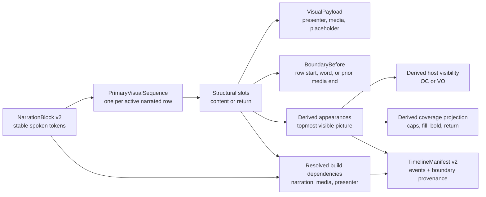

# Issue 56 — ordered visual, hierarchy, and source-trim production contract

Status: **Proposed for Producer acceptance**  
Scope: contract design only; no implementation or shared-contract change  
Authority: GitHub issue #56, product specification Revision 2, and
Producer-accepted issue #14 evidence commit
`11cef62fad9800bdca2934343515dd9a0c3d5172`

## Decision in one sentence

A narrated row has one authoritative, strictly ordered primary-picture
sequence: root slots play continuously, one-level cutaway slots temporarily
cover their parent until an explicit return, word-driven boundaries resolve
from stable word anchors, and the sole non-word exception is a logged B-roll
clip whose immutable logged end drives the next sequential B-roll cut; source
trim, presenter alignment, coverage, ordinals, warnings, and thumbnails are
derived from that structure and are never independent timing ranges.

This is the recommended production contract. It becomes authoritative only
when the Producer records the acceptance response in §15. Until then, issue
#56 remains `In review` and no implementation issue may use this proposal as an
accepted contract.

## 1. Authority reconciliation and bounded choice

The product specification currently makes `TextAnchorRange` the Phase 1
authority for full-frame visual events and host-visibility spans. It permits
independent and overlapping visual ranges because overlays and future lanes
need them. The accepted #14 design instead demonstrated an ordered primary
picture with structural sequential/cutaway relationships, derived intervals,
and explicit returns. Those two models cannot safely share authority for the
same full-frame event.

This contract resolves the conflict as follows:

- a new `script-document/v2` primary-picture sequence becomes authoritative
  for narrated full-frame picture and host visibility;
- independently anchored ranges remain available only for overlays and other
  explicitly concurrent lanes;
- `script-document/v1` remains frozen and supported during migration; and
- v1 full-frame ranges are never silently interpreted as v2 hierarchy.

The accepted #14 artifact is presentation evidence, not an already changed
schema. Its numbered brackets, hover/focus coverage, bold On Camera text,
cutaway conversion, returns, trim player, complete-clip estimate, and swap
demonstrations inform this contract. Its prototype-only `Move to start`
insert-and-shift behavior and general “four locked endpoints” experiment are
not carried forward: both create a second way to change structural timing.
The only v2 same-row reorder is a payload swap; the only logged-video ending
modes are the two explicit modes in §9.

This contract applies to narrated rows. A narration-free primary-audio clip
row continues to own an explicit source in/out range and source-defined row
duration; it does not participate in word inpoints. Overlays retain exact
`TextAnchorRange` authoring and are not structural children in this contract.

## 2. Canonical entities

### 2.1 Identity and authority diagram



Only the sequence and its authored boundaries/payloads are stored in the
document. Appearances, host spans, word coverage, bracket endpoints, ordinals,
warnings, required source endpoints, and thumbnails are projections.

### 2.2 Proposed document types

The following TypeScript-like shapes define the required semantics; exact JSON
property spelling is finalized by the later schema implementation without
changing these meanings.

```ts
type WordInpointAnchor = {
  blockId: UUID;
  tokenId: UUID;
  affinity: "before";
  quotedWord: string;
  anchorVersion: PositiveInteger;
};

type BoundaryBefore =
  | { kind: "row_start" }
  | { kind: "spoken_word"; anchor: WordInpointAnchor }
  | { kind: "previous_media_end"; controllingSlotId: UUID };

type PrimaryVisualPayload =
  | { kind: "on_camera"; presenterChoiceId: UUID | null }
  | { kind: "visual"; payloadId: UUID; source: VisualSource;
      sourceUsage: SourceUsage | null; audioPolicy: AudioPolicy }
  | { kind: "undefined"; payloadId: UUID; description: string };

type ContentSlot = {
  id: UUID;
  kind: "content";
  relation:
    | { kind: "base" }
    | { kind: "sequential" }
    | { kind: "cutaway"; parentSlotId: UUID };
  boundaryBefore: BoundaryBefore;
  payload: PrimaryVisualPayload;
  playoutPolicy: "match_structural_interval" | "complete_logged_clip";
  version: PositiveInteger;
};

type ReturnSlot = {
  id: UUID;
  kind: "return";
  parentSlotId: UUID;
  inpoint: WordInpointAnchor | null;
  version: PositiveInteger;
};

type PrimaryVisualSequence = {
  id: UUID;
  slots: Array<ContentSlot | ReturnSlot>;
  version: PositiveInteger;
};
```

`payloadId` identifies the occurrence-specific editorial payload and moves
with its source, trim, audio, framing, and provenance when payloads are
swapped. `slot.id`, boundary, relation, and playout policy are structural and
do not move during a swap. A return has no payload.

The `on_camera` choice is authored. The system never changes an `undefined` or
non-host payload to On Camera merely to fill a gap. Once authored, On Camera
coverage and later returns to it are derived.

## 3. Structural invariants and renderability

### 3.1 Valid complete structure

1. Every active narrated row has exactly one `PrimaryVisualSequence` and at
   least one content slot.
2. Slot zero is content with `relation.kind = base` and
   `boundaryBefore.kind = row_start`. No later slot may be `base` or
   `row_start`.
3. Every ordinary later content slot starts either at one exact spoken-word
   boundary or, for the one §10 exception, the previous logged clip's media
   end.
4. Exact spoken-word boundaries are strictly increasing in token order. Two
   structural boundaries may not share a word. Zero-length intervals are
   always invalid; there is no exception for a return or placeholder.
5. Root content slots are `base` or `sequential`. A root remains active from
   its boundary through the next root boundary or row end, including while a
   child covers it.
6. This contract permits exactly one cutaway level. A cutaway's parent is the
   most recent root content slot. A cutaway cannot parent another cutaway.
7. One or more consecutive cutaways under the same parent form one cutaway
   group. Exactly one return follows the final child before the next root or
   row end. The return names that parent.
8. The next child's boundary ends the prior child. The return boundary ends
   the final child and reveals the already-playing parent.
9. A complete return has an exact spoken-word inpoint strictly after the last
   child boundary and before any following root boundary. A null return
   inpoint is a permitted authoring state but makes the row unrenderable.
10. A `previous_media_end` boundary occurs only on the immediate next root
    B-roll content slot and names its immediate preceding root B-roll slot.
    Neither side may be On Camera, undefined, a still, a placeholder, a
    cutaway, or a return.
11. A `complete_logged_clip` root may not own cutaways in v2. Supporting a
    continuously playing media-led parent beneath cutaways requires a later
    accepted contract extension.
12. Every derived record interval has positive duration after frame
    resolution. Frame rounding may not collapse two boundaries.

### 3.2 Authoring-invalid versus build-invalid

The document schema intentionally admits two recoverable authoring states:

- `ReturnSlot.inpoint = null`; and
- an authored word anchor whose token/quote no longer resolves.

Both preserve the user's structure and payloads but make the row
`unrenderable`. Preview and release compilation suppress that row's primary
picture and report a blocking diagnostic; they do not guess. Other rows remain
editable and diagnosable.

An exact structure may still be build-invalid when resolved timing collapses a
boundary, source media is short, presenter alignment is unresolved, or a
media-led cut falls outside its legal interval. These conditions also preserve
the document and prior builds.

## 4. Hierarchy, appearances, and source continuity

The compiler first divides a row into structural intervals from each slot's
boundary to the next boundary, or to spoken VO end for the last interval.
It then derives topmost appearances:

| Structural slot | Visible result | Underlying result |
| --- | --- | --- |
| root content | Its payload is visible until a child or next root begins | Its payload plays continuously until the next root or row end |
| cutaway content | Its payload is visible until the next child or return | Parent continues at normal speed underneath |
| return | Parent becomes visible again | No new source event and no source restart |

This continuous-parent rule resolves the reversed B-roll → On Camera → B-roll
case. The B-roll source keeps advancing under the On Camera cutaway and is
revealed at the source frame corresponding to elapsed row time; it is never
paused, restarted, or silently retrimmed. The ordinary On Camera → B-roll → On
Camera case works the same way: presenter picture continues under the B-roll.

Sequential roots do not return. A new root replaces the prior root for the
rest of the row unless another root follows.

The manifest may use a lower picture track for root content and one higher
managed picture track for its non-overlapping children. Track assignment is a
compiler projection, not an authored `layer` value. Independent overlay lanes
remain separate and may appear above both.

## 5. Deterministic authoring projection

### 5.1 Ordinals and exact coverage

- Each content slot receives a row-local, one-based ordinal from its structural
  position. The ordinal is stable during payload swaps. Return slots receive
  no ordinal.
- A non-On-Camera full-frame appearance with exact word boundaries keeps its
  opening and closing caps, carrying the content slot's same ordinal, visible
  at all times.
- Hover or keyboard focus on a B-roll card or any of its visible narration
  segments reveals all topmost narration segments belonging to that payload.
  The fill is contextual; the caps remain visible without hover/focus.
- When a root B-roll is visible, covered by a child, then visible again, both
  visible segments link to the same card and ordinal. The return boundary uses
  an unnumbered return glyph; it never invents a second payload or ordinal.
- All complete spoken words whose topmost appearance is On Camera render in
  unmistakable bold. On Camera receives no B-roll fill and no numbered caps.
- `undefined` coverage is visibly unresolved and non-color-only. It is never
  presented as On Camera.

Ordinals, cap positions, return glyphs, coverage segments, bold spans, and
card associations are recalculated from the sequence after every accepted
edit. They are not serialized as editable ranges.

### 5.2 Contextual start/end-word editing

`Change start word` and `Change end word` operate on the structural boundary
that produced the selected exact B-roll segment:

| Selected endpoint | Boundary actually changed |
| --- | --- |
| content/cutaway start | that content slot's spoken-word `boundaryBefore` |
| segment start caused by return | that `ReturnSlot.inpoint` |
| segment end caused by next content/cutaway | the next content slot's spoken-word `boundaryBefore` |
| segment end caused by return | that `ReturnSlot.inpoint` |

Before confirmation, the UI names the adjacent slot or return that will move.
The transaction accepts only a spoken token strictly between its neighboring
boundaries. It updates the one boundary and its quote evidence, increments the
affected versions, then recomputes every projection atomically. If the target
would cross, equal, or collapse a boundary, the command changes nothing and
reports the legal word interval.

Row start and row end are fixed. Ending the final visual earlier requires
inserting a following content slot; changing the base start is not offered.
A media-derived endpoint is not editable as a word. The author must first
switch the controlling clip back to word-driven playout and choose an exact
word.

## 6. Edit-operation contract

Every operation is one optimistic transaction against the sequence version.
Failure leaves the prior sequence and payloads byte-for-byte unchanged.

| Operation | Deterministic effect |
| --- | --- |
| Insert sequential | Insert a new root content slot at the chosen exact word. Prior root ends there. Payload begins `undefined` unless the author supplied one. |
| Insert cutaway | Insert child content under the most recent root at the chosen exact word and insert one return immediately after it with `inpoint = null`. The row becomes unrenderable until the return word is set. |
| Add later sibling cutaway | Insert before the group's return. Its start ends the prior child; the same final return remains. |
| Convert sequential to cutaway | Allowed only for a root with no children and with a previous root parent. Change its relation, then insert a null return before the next root. No anchor is inferred. |
| Flatten cutaway group | Promote every child, in order, to root sequential slots and remove the one return. A single-card `Make sequential` UI invokes this group operation and previews that all siblings flatten. |
| Swap payloads | Exchange only the two `PrimaryVisualPayload` values. Slot IDs, boundaries, relations, ordinals, and playout policies stay fixed. Reject atomically if either structural playout policy cannot accept the incoming payload. |
| Move payload across rows | Require destination row, exact insertion position, root/cutaway relation, and exact destination word (except row start). Validate destination and source repair first, then remove the source occurrence and insert the same payload ID/settings in one transaction. A failed destination never removes the source. |
| Delete non-base child | Remove it; the prior visible slot continues to the next child or return. If it was the group's last child, remove the now-redundant return too. |
| Delete non-base root | Remove its whole cutaway group only after an explicit choice to move/delete its children, or reject. No child is silently reparented. The prior root continues to the next retained root. |
| Delete return | Not a standalone operation. Flatten the group or delete its last child. |
| Delete base | Apply §6.1 atomically. |

Same-row card-on-card drag means `Swap payloads`. There is no structural
insert-and-shift `Move to start` operation in v2. Choosing the base as a swap
target is the production equivalent and preserves hierarchy. This explicitly
supersedes the prototype-only alternative retained in #14.

### 6.1 Base deletion

Base deletion never guesses a replacement:

1. Remove the base payload and its root slot.
2. If it owned children, promote those children in order to root sequential
   slots. The first promoted child becomes the new base at row start; later
   child boundaries do not move.
3. Remove the former return. At its exact former inpoint, insert an
   `undefined` sequential slot unless an existing retained root already starts
   there. This preserves the final former cutaway's prior outpoint rather than
   extending it silently.
4. If there were no children, promote the next root to base and row start. Its
   later outpoint remains unchanged.
5. If nothing remains, insert one `undefined` base at row start.

The operation previews the resulting sequence and any new undefined slot. It
commits as one Undo unit. It never silently makes the row On Camera.

### 6.2 Cross-row source repair

Removing a moved source slot uses the same deletion rules above. Destination
placement never reuses the source word anchor because anchors are row-local.
Moving a payload also moves its occurrence-owned source inpoint and other
payload settings, but destination duration is recomputed. A previously valid
clip may therefore become `probably_short` or `insufficient_source`; that
result is shown before commit when timing evidence permits.

## 7. Word-anchor lifecycle and duplicate-inpoint decision

An in-word is valid only when all of these remain true in the current row
revision:

- `blockId` still names the owning narration row;
- `tokenId` still names a spoken token;
- `quotedWord` exactly matches that token's current spoken text; and
- the token remains strictly between adjacent structural boundaries.

Inserting or editing other words does not move a surviving anchor. If an
anchored token is deleted, replaced, split, merged, moved to another row, or
retains its ID with different spoken text, the anchor becomes
`needs_reattachment`. The document retains the prior token ID, quote, neighbor
evidence, slot identity, and structure. The UI identifies the affected visual
or return and offers only: choose a new exact word, undo/restore the narration,
or leave the row unrenderable. No nearest-word, matching-text, ordinal-offset,
or quoted-text heuristic commits automatically.

Two slots may **not** share one in-word. Equal word boundaries and any
frame-resolved zero-length interval are errors. This remains true when the
payloads differ or one is undefined. A media-derived boundary must likewise
resolve strictly after its controller and before the next exact boundary/row
end.

## 8. Presenter synchronization and recovery

An On Camera slot begins at the same resolved record frame as its structural
boundary:

- temporary narration uses the configured presenter still beginning on that
  frame and lasting for the derived On Camera appearance;
- recorded presenter media uses the approved take's verified word alignment
  to map the same `WordInpointAnchor` to a master-source frame; and
- a returning On Camera parent is not restarted. Its presenter source has
  continued under the cutaway and is merely revealed.

The compiler dependency for a recorded build supplies a
`PresenterAlignmentResolution` keyed to the On Camera content slot and take
assignment. A resolved value includes take/master identity, source start,
alignment version, precision, and the matching expected/recognized word
evidence. The record boundary remains the narration/approved-performance word
frame; the dependency only chooses the corresponding source frame.

If the selected take cannot align to the On Camera word, the state is
`presenter_alignment_unresolved`:

- the word anchor and editorial sequence remain unchanged;
- a recorded-version build is blocked for that slot;
- no nearest spoken word or proportional source offset is substituted; and
- the recoverable choices are another approved take, an explicit human-mapped
  source frame with retained evidence/precision, `needs pickup`, or an explicit
  locked-temp-voice plus presenter-still fallback for that build.

The fallback is build-specific and does not mark the recorded take aligned.
Insufficient presenter source after a valid start is a separate blocking
`presenter_source_too_short` issue with the same non-destructive choices.

## 9. Logged-source trim, duration, and Research handoff

### 9.1 Ownership and exact bounds

The immutable VERA Research clip snapshot owns media identity, content hash,
source rate/time base, `loggedStartFrame`, `loggedEndExclusiveFrame`, and total
logged duration. A Script-to-Timeline visual payload references that snapshot.
Each occurrence separately owns:

```ts
type SourceUsage = {
  sourceInFrame: NonNegativeInteger; // absolute in the snapshot time base
};
```

`sourceInFrame` must lie in the half-open logged interval. Changing it changes
only that occurrence and never the Research snapshot, media bytes, logged
bounds, or another occurrence.

### 9.2 Narration-driven endpoint

For `match_structural_interval`, the record interval is authoritative. At
normal speed the compiler derives:

```text
required source duration = structural record duration
required source out       = source in + required source duration
```

The displayed source endpoint is derived and is never stored as a competing
authoritative outpoint. Rate conversion uses exact rational media time. The
exclusive source frame is the first source-frame boundary at or after the
required end; the manifest records any sub-timeline-frame rounding delta. This
is normal-rate frame quantization, not a retime or hold.

The parent root's required duration includes time spent underneath cutaways,
because its source continues to play. A child needs only its own interval.

### 9.3 Short-source states and allowed remedies

Before final aligned timing, compare remaining logged duration with the
current draft timing estimate. A likely overflow is `probably_short`: an
advisory, non-color-only warning that does not mutate the payload or block
writing. With authoritative build timing, a derived endpoint beyond
`loggedEndExclusiveFrame` is `insufficient_source` and blocks that visual's
build; it never truncates or changes the narration boundary.

Allowed explicit remedies are:

- choose an earlier valid occurrence source inpoint;
- choose another immutable logged clip/version;
- change the script boundary or visual structure;
- explicitly choose complete-clip playout when its different editorial result
  is valid; or
- request a longer immutable logged clip from VERA Research.

The baseline contract forbids automatic or implicit hold, freeze, speed
change, time remap, loop, ping-pong, reverse, frame repeat, optical flow, or
generative extension. Those remedies are not enabled by #56 and require a
later Producer-accepted policy contract if ever desired.

### 9.4 Bounded Research handoff

`Capture longer in Research` creates or opens a proposed request containing
only the existing Research clip snapshot ID, originating project/document/row/
payload IDs, current source inpoint, required additional duration/frames,
controlling script boundaries, and a human-readable reason. It grants no URL,
download, deletion, or mutation authority to Script to Timeline.

The current occurrence remains intact and warned. Research may create a new
immutable logged clip/version through its own audited flow. The author must
explicitly select that returned version; neither product silently replaces the
old reference. Cancelling or failing the handoff changes no data.

Script to Timeline exposes no direct YouTube logger, URL field, download
action, or hidden acquisition path. YouTube may appear only as provenance on
an already logged Research clip.

## 10. Thumbnail derivation and refresh

A logged-video thumbnail is the first fully decoded presentation frame whose
timestamp is at or after the occurrence's current `sourceInFrame`. Seeking may
use a prior keyframe internally, but that keyframe is never returned as the
thumbnail unless it is also the selected frame.

The immutable derivation key is:

```text
media content hash
+ Research clip snapshot/version ID
+ source time base and sourceInFrame
+ decoder/version profile
+ output size/color profile
```

Changing any key input marks the current thumbnail stale and enqueues an
idempotent derivation for the new key. The UI must not present the old frame as
current: it may show it only with an explicit non-color `Updating thumbnail`
state, or show a placeholder. The new artifact replaces the projected image
atomically only if its completed key still equals the occurrence's current
key. Late results from rapid trim changes remain cached but cannot overwrite a
newer selection.

Decode failure preserves the source inpoint and clip choice, reports a
recoverable thumbnail diagnostic, and shows a labeled placeholder. Retrying
the same key is idempotent. Thumbnail artifacts never enter the source media or
timeline manifest and never mutate Research data.

## 11. Complete-clip playout and media-derived boundary

### 11.1 Exclusive modes

A logged root B-roll slot has exactly one structural playout policy:

| Policy | End authority | Following boundary |
| --- | --- | --- |
| `match_structural_interval` | next exact word/return/root boundary or row end | authored exact boundary |
| `complete_logged_clip` | immutable logged end after the occurrence source inpoint | immediate next root B-roll slot has `previous_media_end` |

`complete_logged_clip` means play every remaining frame from `sourceInFrame`
through `loggedEndExclusiveFrame`. There is no authored source outpoint and no
authored narration out-word for that cut. The mode requires an immediate next
sequential B-roll root and cannot be final, On Camera-adjacent, a cutaway,
undefined, or combined with child cutaways. Switching into the mode atomically
removes the following slot's word anchor and records its derived boundary;
switching out requires the author to choose a new exact word. Stale/imported
state containing both authorities is `boundary_authority_conflict` and does
not compile.

### 11.2 Draft five-word estimate

The estimate never enters `ScriptDocument` as an anchor. It is a derived view
with policy ID `media_cut_estimate/v1`:

1. Compute normal-speed remaining media duration from occurrence source in to
   logged end.
2. Add it to the controlling slot's estimated record start.
3. Build an estimated timing vector for spoken tokens only, excluding
   directions and non-spoken annotations. Prefer the current preview narration
   asset's validated word timing. If unavailable, use a deterministic
   150-spoken-words-per-minute fallback: 400 ms per spoken token from row
   start.
4. Find the first token whose estimated end is after the estimated cut. Select
   a window of five spoken tokens centered with up to two tokens before that
   token, then backfill from the other side near a row edge. A shorter row uses
   every available token.
5. Render a directional gradient across only that window. Omit the controlling
   clip's closing numbered cap and the following slot's opening numbered cap.
   Label it non-authoritatively as `Estimated media-timed cut` for assistive
   technology and details.

The estimate recomputes when narration tokens/order, preview narration hash or
timing version, source inpoint, logged bounds, media time base, slot start,
payload swap, or playout policy changes. A stale estimate is never retained as
if current. Changing the estimate moves no slot and changes no build input.

### 11.3 Exact build boundary

With build timing, the compiler converts the exact remaining media duration to
the record time base and sets the next slot's record start to the first
timeline-frame boundary at or after the source end. It records the exact
rational source end, chosen record frame, and rounding delta. The first clip's
record out and the next clip's record in are the same frame; there is no gap or
overlap.

The resolved cut must be strictly after the controller start and strictly
before the next later exact boundary or row end. Otherwise it is
`media_boundary_out_of_order` and the row does not compile.

The manifest classifies its relation to narration timing:

- `between_words`, naming the previous and next token IDs;
- `inside_word`, naming the token ID plus frame offset from that word's start;
  or
- `at_word_start`, naming the token but retaining media-end authority.

After resolution, the authoring view replaces the uncertainty gradient with
one unnumbered media-cut marker associated with both visual ordinals. For an
inside-word cut it labels `Cut during “<word>” at +<frames>`; for a between-word
cut it labels the surrounding words. It never creates an exact word anchor or
numbered brackets, even when it happens to land on a word start. Converting to
word-driven mode is the only way to create numbered exact-word caps.

Restricting this v2 mode to B-roll → B-roll avoids inventing a mid-word
presenter synchronization or host-visibility boundary. A later contract must
be accepted before media timing may cut to or from On Camera.

## 12. Compiler and manifest contract

### 12.1 Pure compiler sequence

The later v2 compiler must perform these steps in order:

1. Validate slot identities, single-level grammar, boundary authority, return
   completeness, and payload-policy compatibility.
2. Resolve surviving word anchors against the exact narration/take alignment;
   preserve and report stale anchors rather than repair them.
3. Resolve any media-end boundary from immutable logged bounds and normal-speed
   rational time.
4. Assert all boundaries are strictly increasing and positive after frame
   quantization.
5. Derive root continuous intervals, child intervals, returns, topmost
   appearances, host visibility, coverage segments, and source needs.
6. Resolve presenter dependencies and logged media dependencies.
7. Validate source endpoints against logged bounds. Emit no partial event for
   a blocking row.
8. Emit deterministic timeline events and a complete boundary-provenance
   snapshot; then run the existing cross-track and manifest validation.

Identical canonical document, dependency bytes, compiler version, and settings
must emit byte-identical manifest and report JSON.

### 12.2 Manifest v2 evidence

`timeline-manifest/v2` retains exact integer record/source ranges and adds one
`VisualSequenceResolution` per narrated row. It freezes:

- document, block, sequence, slot, payload, and return IDs;
- slot order, root/cutaway/return relation, and row-local ordinal;
- resolved record frame for every row-start, word, return, media-end, and row-
  end boundary;
- original word anchor plus timing/alignment precision for word boundaries;
- controller slot, Research snapshot, source in/out, rational duration, record
  frame, rounding delta, and token relation for media-end boundaries;
- the continuous parent event and each child event it underlies/overrides; and
- occurrence source range, presenter alignment identity, and payload
  provenance.

Timeline events reference both `slotId` and `payloadId`. A continuous root has
one event even when cutaways cover it. A return emits no media event but remains
in `VisualSequenceResolution`, so the manifest can prove why the parent became
visible again.

`build-report/v2` reports sequence validation, stale anchors, missing returns,
presenter alignment, source sufficiency, media-boundary classification,
fallback choice, and Research handoff eligibility. It never reports an
estimated gradient as compiled timing.

## 13. Producer-reviewable contract-change note

### 13.1 What changes

After Producer acceptance, a later implementation may propose these versioned
artifacts together:

- `script-document/v2`: add `PrimaryVisualSequence`; remove full-frame timing
  authority from independent `VisualEvent.range` and remove authored
  `hostVisibilitySpans` as canonical v2 input; retain independently anchored
  overlay events.
- `compiler-dependencies/v2`: add immutable Research logged bounds/time base,
  occurrence source resolution, and presenter alignment resolution keyed by
  slot/take; retain narration timing and verified media identities.
- `timeline-manifest/v2`: add `VisualSequenceResolution`, slot/payload
  provenance, boundary sources, rational-rate resolution evidence, and return
  entries while retaining exact event record/source ranges.
- `build-report/v2`: add the diagnostics and recovery evidence in §§8-12.
- Prompter export: continue emitting the accepted `prompter-export/v1` artifact
  shape, but derive OC/VO state from v2 topmost primary-picture appearances.
  Identical semantic input must keep visible prompter text behavior unchanged.

### 13.2 Why a new version is required

This is not a safe additive v1 field. v1 has two independently authored
authorities—full-frame `VisualEvent.range` and `HostVisibilitySpan.range`—and a
single visual event maps to one manifest event. v2 makes structural boundaries
authoritative, may compile one root underneath several children, and derives
host visibility. Accepting both models in one v1 document would permit
contradiction and nondeterministic precedence.

### 13.3 What breaks or changes behavior

- Full-frame v1 range editors cannot write v2 primary picture directly.
- Current compiler/validator code that reads `VisualEvent.range`, authored
  `layer`, and authored host spans needs a parallel v2 path.
- A root payload may create one continuous underlying timeline event while its
  visible coverage has several segments.
- The #14 prototype's same-row `Move to start` insert-and-shift action is not a
  v2 operation; swap-with-base replaces it.
- The prototype's general four-lock source/narration endpoint experiment is
  replaced by the two exclusive §11 modes.
- Current v1 behavior that throws a generic short-video error needs retained,
  typed build issues and recovery evidence in v2.
- UI code may display derived ranges but may not persist them as another model.

No existing v1 contract, fixture, golden, or accepted build changes bytes.

### 13.4 Compatibility and migration

1. Keep the v1 validator/compiler available for existing immutable documents
   and builds during a declared compatibility window.
2. Migration is explicit, creates a new document revision, retains the v1
   source/hash, and produces a `VisualSequenceMigrationReport`.
3. A v1 narrated row may auto-migrate only when its full-frame ranges and host
   spans form one exact, gap-free, non-overlapping word partition; every event
   boundary is a word start or row end; and payload/host state agree. Such a
   row becomes flat sequential roots only. Hierarchy is never inferred.
4. Overlap, gap, zero length, sentence/cue precision, ambiguous shared
   boundary, overlay/full-frame confusion, quoted-text mismatch, or host/
   visual disagreement yields `migration_needs_review`. The migration keeps
   every source entity and proposes no replacement word.
5. The author explicitly repairs each flagged row in a review UI and confirms
   the new sequence before v2 becomes active. Cancelling leaves v1 untouched.
6. Prior manifests/builds remain immutable and continue to identify their
   original schema/compiler version.

### 13.5 Generated types and fixtures

The implementation must regenerate checked-in TypeScript and Python types for
all four v2 schemas and retain generated-currentness checks. It must add
slice-owned fixtures and byte-identical goldens for at least:

1. flat sequential On Camera/B-roll and B-roll/B-roll rows;
2. On Camera parent with two B-roll children and one return;
3. reversed B-roll parent, On Camera child, B-roll return with continuous
   parent source;
4. null/stale return, deleted/replaced in-word, equal inpoints, crossed
   boundaries, and frame-collapse failures;
5. exact start/end boundary edits and atomic rejection;
6. swaps including base, invalid complete-mode swap, cross-row destination
   placement, and base deletion with undefined former-return slot;
7. resolved and unresolved recorded-presenter alignment plus explicit temp-
   still fallback;
8. source-in changes, exact derived source out, draft probably-short warning,
   build-time overflow, and forbidden hidden retime/loop/hold;
9. thumbnail key, exact selected frame, rapid-change late-result rejection,
   and decode failure;
10. complete clip whose cut resolves between words, inside a word, at a word
    start, beyond row end, and to a forbidden On Camera target;
11. deterministic five-token fallback/preview estimates and invalidation when
    narration/audio/source inputs change;
12. safe v1 flat migration and every `migration_needs_review` case; and
13. absence of direct YouTube logging/URL-entry capability in Script to
    Timeline contracts and UI acceptance.

Previously accepted fixtures and goldens remain byte-identical. Any needed
change to one requires a separate Producer-approved fixture/contract-change
note.

### 13.6 Acceptance impact

Implementation is not accepted by schema tests alone. Its issue must retain:

- deterministic validator/compiler/golden evidence;
- UI evidence that projections never become independently editable ranges;
- keyboard and pointer evidence for every edit operation and non-color state;
- media evidence for frame-exact thumbnail/source-bound behavior;
- recorded-presenter alignment/fallback evidence;
- Research handoff evidence in the real authorized applications without
  mutating the prior clip; and
- Resolve or OTIO evidence that roots continue under cutaways and media-led
  cuts share one exact record frame.

The acceptance authority for each implementation slice remains whatever the
roadmap field names; acceptance of this design does not pre-accept code.

## 14. Diagnostics and recovery summary

| Code/state | Severity at build | Recovery; never automatic |
| --- | --- | --- |
| `return_inword_needed` | blocking row | choose exact return word or flatten/delete group |
| `anchor_needs_reattachment` | blocking row | choose exact word or restore narration |
| `duplicate_or_crossed_inpoint` | blocking row | choose a word strictly inside legal neighbors |
| `frame_boundary_collapsed` | blocking row | move exact boundary or change timing source |
| `undefined_primary_picture` | blocking row | choose On Camera, visual, or accepted placeholder |
| `presenter_alignment_unresolved` | blocking recorded build | another take, evidenced manual map, pickup, or explicit temp fallback |
| `presenter_source_too_short` | blocking recorded build | another take/trim, pickup, or explicit temp fallback |
| `probably_short` | drafting advisory | earlier source in, different/longer clip, boundary edit, or explicit mode change |
| `insufficient_source` | blocking authoritative build | earlier in, different/longer clip, boundary edit, or valid complete mode |
| `boundary_authority_conflict` | blocking row | choose word-driven or complete-clip mode |
| `media_boundary_out_of_order` | blocking row | choose different source/inpoint/mode or edit surrounding structure |
| `thumbnail_stale` / `thumbnail_decode_failed` | non-blocking visual diagnostic | current-key retry or labeled placeholder |
| `migration_needs_review` | blocks v2 activation only | explicit row reconstruction; v1 remains usable |

All diagnostics identify document, row, sequence, slot/return, payload where
applicable, source evidence, and the first violated invariant. Color is never
the sole signal. Prior builds and source media remain untouched.

## 15. Acceptance mapping and Producer checklist

### 15.1 Issue #56 acceptance mapping

| Issue acceptance or unresolved decision | Contract evidence |
| --- | --- |
| Deterministic intervals without freeform overlap | §§2-5, §12 |
| Atomic cutaway plus required return | §§3.1, 6 |
| Full-region projection, ordinals, unnumbered return, bold OC | §5 |
| Right-click boundary changes and no silent overlap | §5.2 |
| Sequential, indented, reversed, swap, move, delete | §§4, 6 |
| Recorded/temp presenter word sync and mismatch recovery | §8 |
| Logged total/source in/derived endpoint/overflow/handoff | §9 |
| First decoded thumbnail at current inpoint and refresh | §10 |
| Complete clip, compiler boundary, gradient, bracket omission | §11 |
| No direct YouTube logging or URL entry | §9.4 |
| Deleted/replaced anchor word | §7 |
| Shared in-word / zero length | §§3.1, 7 |
| Hold/retime/loop decision | §9.3 |
| Schema/manifest/compiler/compatibility/migration/types/fixtures | §§12-13 |

### 15.2 Producer acceptance steps

Automated repository evidence is reported on issue #56 with the review commit.
The following checks are Producer judgment and must be run in order:

1. Open this document at §§1-3 and review the v2 entity shapes and twelve
   invariants. **Expected:** one sequence, not independent ranges, controls
   narrated full-frame picture; overlays stay separate; exactly one cutaway
   level is allowed; a missing return is retained but unrenderable; equal
   in-words are invalid.
2. Review §§4-5 using both On Camera → B-roll → On Camera and reversed B-roll →
   On Camera → B-roll. **Expected:** the parent source continues under its
   child; a return restarts nothing; all visible B-roll segments link to the
   same slot/ordinal; returns add no ordinal; On Camera is authored, bold, and
   never receives B-roll fill.
3. Review §5.2 and §6. **Expected:** start/end edits name and atomically move
   one shared structural boundary; card-on-card reorder swaps payloads only;
   cross-row moves cannot lose the source; base deletion promotes children and
   inserts an undefined slot at the former return so no prior outpoint changes
   silently. Confirm the prototype-only insert-and-shift `Move to start` is
   intentionally superseded by swap-with-base.
4. Review §§7-8. **Expected:** deleted/replaced anchored words never retarget;
   two inpoints never share a word; recorded and temporary presenter starts use
   the same narration boundary; an unaligned presenter take blocks recorded
   build but keeps repair, pickup, and explicit temp fallback paths.
5. Review §9. **Expected:** Research owns immutable logged bounds; each script
   occurrence owns only its source inpoint; narration derives source out;
   draft shortage warns and authoritative shortage blocks; no hold/retime/loop
   occurs; `Capture longer in Research` is a bounded request and never a direct
   YouTube/URL logging path or silent replacement.
6. Review §10. **Expected:** the thumbnail is the first decoded frame at/after
   the exact selected source frame; changing trim cannot let an older async
   result overwrite the current thumbnail; failures preserve the trim and show
   a labeled placeholder.
7. Review §11. **Expected:** complete-clip mode plays from source in through
   immutable logged end and exclusively controls the next B-roll root; the
   five-word estimate is deterministic, invalidates on all timing inputs, and
   has no exact brackets; the compiled cut uses one exact shared frame and
   truthfully represents between-word or inside-word timing without inventing
   an anchor.
8. Review §§12-14. **Expected:** compiler order and manifest provenance can
   reproduce every boundary; v2 is an explicit breaking version; v1 bytes and
   builds remain unchanged; ambiguous migration requires review; generated
   types, negative fixtures, byte-identical goldens, and external evidence are
   all named before implementation.
9. Record exactly one response on issue #56:
   - acceptance: `Accept issue #56 ordered visual, hierarchy, presenter sync, source-trim, thumbnail, and complete-clip production contract.`
   - failure: `Issue #56 acceptance failed at checklist step <number>: <first ambiguous or incorrect contract decision>.`

Leave issue #56 `In review` until that response is explicit. Agent self-report,
passing validation, or silence is not Producer acceptance and must never move
the issue to `Done`.
